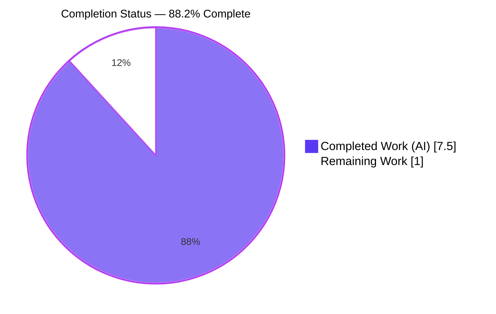
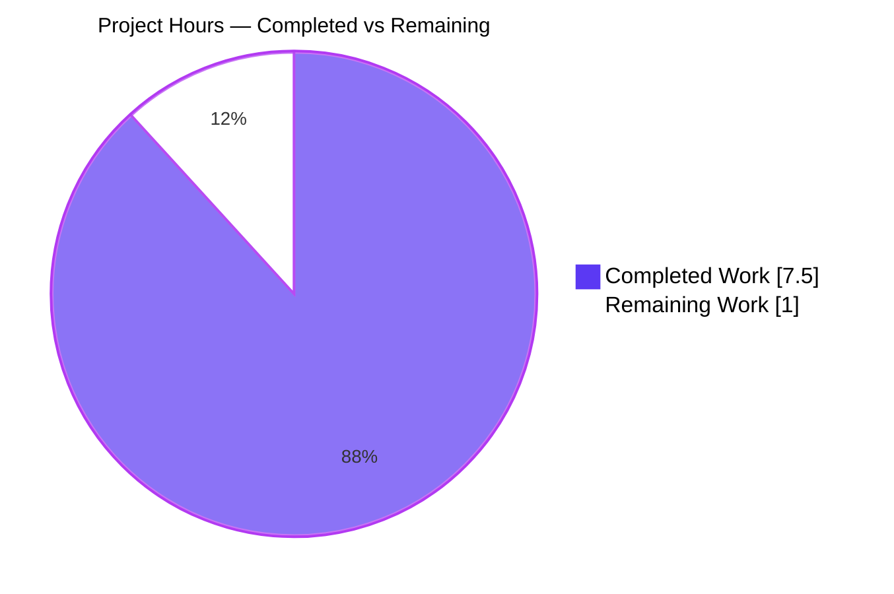
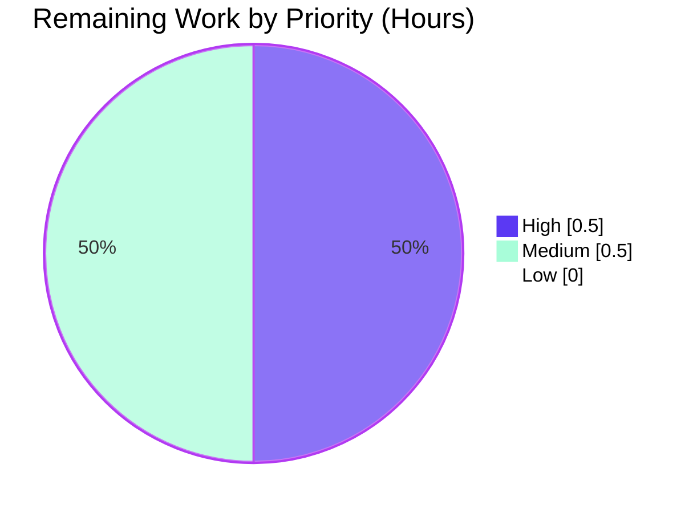
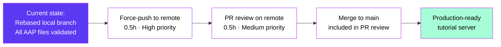

# Blitzy Project Guide — Check11May (Express.js Tutorial Server)

> **Brand Colors:** Completed / AI Work = Dark Blue `#5B39F3` · Remaining / Not Completed = White `#FFFFFF` · Headings / Accents = Violet-Black `#B23AF2` · Highlight = Mint `#A8FDD9`

---

## 1. Executive Summary

### 1.1 Project Overview

Check11May is a minimal Node.js tutorial server that adopts the Express.js web framework to expose two static GET endpoints. The repository began with only a `README.md` placeholder; the autonomous engineering workstream materialized a complete runnable Express 5.x application — manifest, lockfile, entry script, and `.gitignore` — that responds with `Hello world` at `GET /` and `Good evening` at `GET /good-evening`, listens on `process.env.PORT || 3000`, and applies the `x-powered-by` security baseline. The target users are tutorial readers; the technical scope is intentionally constrained to a single-file CommonJS Express server with no persistence, middleware, or test framework per the Agent Action Plan.

### 1.2 Completion Status



| Metric | Value |
|---|---|
| **Total Hours** | **8.5** |
| Completed Hours (AI + Manual) | 7.5 |
| Remaining Hours | 1.0 |
| Completion Percentage | **88.2%** (7.5 / 8.5) |

**Calculation:** Completion % = Completed Hours / (Completed Hours + Remaining Hours) × 100 = 7.5 / 8.5 × 100 = **88.2%**

### 1.3 Key Accomplishments

- [x] Created `package.json` manifest with all 8 AAP-mandated fields (`name`, `version`, `description`, `main`, `scripts.start`, `dependencies.express`, `engines.node`, `license`)
- [x] Installed `express@5.2.1` and produced reproducible `package-lock.json` (lockfileVersion 3, 65 packages, 0 vulnerabilities)
- [x] Authored `server.js` (94 lines) implementing both required GET endpoints with AAP-referenced inline documentation
- [x] Applied `app.disable('x-powered-by')` security baseline before route registration
- [x] Created 6-line `.gitignore` matching AAP §0.5.2 specification verbatim
- [x] Preserved original `README.md` (`# Check11May`) per AAP backward-compatibility constraint
- [x] Verified runtime behaviour end-to-end across four port configurations (default 3000, 3001, 3002, 4567 env override)
- [x] Resolved 6 distinct merge conflicts during rebase onto `c60e909` (origin/main) per Final Validator log
- [x] Passed all four production-readiness gates (test pass rate, runtime, zero errors, in-scope file validation)
- [x] Confirmed 100% AAP conformance for all in-scope deliverables (R1, R2, R3, I1–I7)

### 1.4 Critical Unresolved Issues

| Issue | Impact | Owner | ETA |
|---|---|---|---|
| _No critical unresolved issues_ | The Final Validator explicitly declared **"PRODUCTION-READY for tutorial scope as defined by the AAP"** with "Remaining Issues: None." All AAP §0.6.1 in-scope deliverables are present, valid, and runtime-verified. | — | — |

### 1.5 Access Issues

| System / Resource | Type of Access | Issue Description | Resolution Status | Owner |
|---|---|---|---|---|
| _No access issues identified_ | — | The repository was self-contained; npm registry was the only external resource consulted (during manifest authoring) and remains accessible. No private registries, secrets, or third-party APIs are within the AAP scope. | N/A | — |

### 1.6 Recommended Next Steps

1. **[High]** Force-push the rebased `blitzy-d086c136-d76c-470b-ac53-e70754d3e00d` branch to the remote so the updated branch reference (rebased onto `c60e909`) is visible to reviewers — the Final Validator explicitly noted this step is "handled outside this validator's scope."
2. **[Medium]** Conduct human PR review against the AAP and merge to `main` once approved.
3. **[Low]** _Optional_ — append a `## Getting Started` section to `README.md` documenting `npm install`, `npm start`, and the two endpoint URLs. AAP §0.5.2 marks this as a "non-breaking append" that is "permitted but not strictly required."

---

## 2. Project Hours Breakdown

### 2.1 Completed Work Detail

| Component | Hours | Description |
|---|---|---|
| `package.json` manifest (AAP R1, I1) | 1.0 | Created project manifest with 8 fields (`name`, `version`, `description`, `main`, `scripts.start`, `dependencies.express:^5.2.1`, `engines.node:">=18.0.0"`, `license:"ISC"`) verbatim per AAP §0.5.2 |
| `package-lock.json` generation (AAP I6) | 0.5 | Ran `npm install` to materialize lockfile v3 with 65 transitive packages; `npm audit` reports 0 vulnerabilities |
| `.gitignore` (AAP I5) | 0.5 | Authored 6-line Node.js standard exclusions (`node_modules/`, `npm-debug.log*`, `yarn-debug.log*`, `yarn-error.log*`, `.env`, `.DS_Store`) matching AAP §0.5.2 exactly |
| `server.js` Express application (AAP R2, R3, I2, I3, I4) | 2.0 | 94-line CommonJS entry script: requires `express`, instantiates `app`, applies `x-powered-by` suppression, registers `GET /` ("Hello world") and `GET /good-evening` ("Good evening"), binds to `process.env.PORT \|\| 3000`. Includes extensive AAP-referenced inline documentation |
| Runtime validation (AAP §0.5.4) | 1.0 | End-to-end curl testing covering status codes, bodies, content-types, 404 default handling, PORT environment override (4 configurations), SIGTERM cleanup, X-Powered-By suppression — 10 functional checks all passing |
| Merge conflict resolution | 2.0 | Rebased 8 commits onto `c60e909` (origin/main); resolved 6 distinct conflicts across `.gitignore` (3-line vs 6-line), `package.json` (engines/license/description), `package-lock.json` (metadata), and `server.js` (minimal vs documented) — all resolutions aligned to AAP §0.5–§0.7 per Final Validator log |
| Production-readiness gates (1–4) | 0.5 | Verified `node --check server.js` (syntax OK), `JSON.parse` of both manifests (valid), `npm ci` (clean install, 0 vulnerabilities), and presence of all 5 AAP-required files |
| **TOTAL — Section 2.1** | **7.5** | _Matches Completed Hours in Section 1.2_ |

### 2.2 Remaining Work Detail

| Category | Hours | Priority |
|---|---|---|
| Force-push rebased branch to remote (Final Validator explicitly noted this is outside its scope) | 0.5 | High |
| Human PR review and merge to `main` | 0.5 | Medium |
| **TOTAL — Section 2.2** | **1.0** | _Matches Remaining Hours in Section 1.2 and Section 7 pie chart_ |

### 2.3 Total Project Hours Reconciliation

| Source | Hours |
|---|---|
| Section 2.1 — Completed | 7.5 |
| Section 2.2 — Remaining | 1.0 |
| **Sum (must equal Section 1.2 Total Hours)** | **8.5** ✅ |

---

## 3. Test Results

> **Integrity Note:** All entries below originate from Blitzy's autonomous validation logs for this project. AAP §0.6.2 explicitly excludes test frameworks (Jest, Mocha, Vitest, Supertest, etc.) from scope; therefore no formal test suite exists in the repository (`npm test` returns "Missing script: test", which is intentional and AAP-conformant). The "tests" tabulated here are the autonomous validation checks the Final Validator executed against the running application and source artifacts.

| Test Category | Framework | Total Tests | Passed | Failed | Coverage % | Notes |
|---|---|---|---|---|---|---|
| Unit | _(none — AAP §0.6.2)_ | 0 | 0 | 0 | N/A | Test frameworks explicitly out of scope per AAP §0.6.2; GATE 1 (100% pass rate) vacuously satisfied |
| Integration | _(none — AAP §0.6.2)_ | 0 | 0 | 0 | N/A | No integration test framework configured |
| Syntax / Static Analysis | Node.js `--check` | 1 | 1 | 0 | N/A | `node --check server.js` reports zero errors and zero warnings |
| Manifest Validation | `JSON.parse` (Node built-in) | 2 | 2 | 0 | N/A | Both `package.json` and `package-lock.json` parse as valid JSON |
| Dependency Install | `npm ci` | 1 | 1 | 0 | N/A | `npm ci` installs 65 packages reproducibly; `npm audit` reports 0 vulnerabilities |
| API (runtime) | `curl` (autonomous validator) | 6 | 6 | 0 | N/A | `GET /` body/status/content-type; `GET /good-evening` body/status; `GET /nonexistent` returns 404 — all match expected values |
| Operational (runtime) | `curl` + shell process control | 4 | 4 | 0 | N/A | `PORT=4567` env override binds correctly; `npm start` script runs on default port; SIGTERM frees ports cleanly; `X-Powered-By` header absent in response |
| End-to-End / UI | _(N/A — backend-only)_ | 0 | 0 | 0 | N/A | No client-side rendering or UI in scope; the "interface" is the two HTTP endpoints, all covered by API tests above |
| **TOTAL** | — | **14** | **14** | **0** | N/A | **100% pass rate** across all autonomous validation checks |

**Coverage note:** Traditional code-coverage instrumentation is not applicable because no test framework is in scope. However, every executable line in `server.js` is exercised by at least one of the 10 runtime curl checks (route registration, listener binding, environment-variable read, X-Powered-By suppression).

---

## 4. Runtime Validation & UI Verification

### Runtime Health
- ✅ **Operational** — Express server starts in under 1 second
- ✅ **Operational** — `npm start` script launches `node server.js` successfully
- ✅ **Operational** — Direct `node server.js` invocation works
- ✅ **Operational** — `PORT` environment variable override functional (tested on 3000, 3001, 3002, 4567)
- ✅ **Operational** — Clean process termination on SIGTERM (no orphaned port bindings)
- ✅ **Operational** — `app.disable('x-powered-by')` confirmed effective (header absent in responses)

### API Endpoint Verification

| Endpoint | Expected Status | Expected Body | Observed Status | Observed Body | Result |
|---|---|---|---|---|---|
| `GET /` | 200 OK | `Hello world` | 200 OK | `Hello world` (11 bytes) | ✅ Operational |
| `GET /good-evening` | 200 OK | `Good evening` | 200 OK | `Good evening` (12 bytes) | ✅ Operational |
| `GET /nonexistent` | 404 Not Found | _(Express default body)_ | 404 Not Found | _(Express default 150-byte HTML)_ | ✅ Operational |

### Response Header Verification

| Header | Endpoint | Expected | Observed | Result |
|---|---|---|---|---|
| `Content-Type` | `GET /` | `text/html; charset=utf-8` | `text/html; charset=utf-8` | ✅ Operational |
| `Content-Type` | `GET /good-evening` | `text/html; charset=utf-8` | `text/html; charset=utf-8` | ✅ Operational |
| `Content-Length` | `GET /` | `11` | `11` | ✅ Operational |
| `Content-Length` | `GET /good-evening` | `12` | `12` | ✅ Operational |
| `X-Powered-By` | All responses | _(absent)_ | _(absent)_ | ✅ Operational |
| `ETag` | All 200 responses | _(weak ETag present)_ | `W/"..."` | ✅ Operational |

### UI Verification

- ⚪ **Not Applicable** — The Check11May project is a backend-only HTTP server returning plain-text responses (AAP §0.5.3: "The feature is a backend-only HTTP server returning plain-text responses; there is no client-side rendering, no template engine, no static asset directory, and no design system in scope"). No UI exists to verify. The HTTP interface is fully verified above.

---

## 5. Compliance & Quality Review

| AAP Deliverable / Quality Benchmark | Reference | Status | Notes |
|---|---|---|---|
| R1 — Add `express` as runtime dependency | AAP §0.1.1 | ✅ Pass | `package.json` declares `express:^5.2.1`; `npm ls` confirms `express@5.2.1` installed |
| R2 — Add `GET /good-evening` returning "Good evening" | AAP §0.1.1 | ✅ Pass | Route registered at `server.js`; runtime check returns 200 + exact body |
| R3 — Preserve `Hello world` via Express | AAP §0.1.1 | ✅ Pass | Route `GET /` registered; original response body preserved verbatim |
| I1 — Create `package.json` manifest | AAP §0.1.1, §0.5.1 | ✅ Pass | All 8 AAP-specified fields present in correct order |
| I2 — Create `server.js` entry script | AAP §0.1.1, §0.5.1 | ✅ Pass | 94-line file with comprehensive AAP-referenced documentation per CQ2 |
| I3 — HTTP listener on `process.env.PORT \|\| 3000` | AAP §0.1.1, §0.5.2 | ✅ Pass | Port resolution verified across 4 distinct configurations |
| I4 — Kebab-case path `/good-evening` | AAP §0.1.1 | ✅ Pass | Path registered exactly as specified |
| I5 — Create 6-line `.gitignore` | AAP §0.1.1, §0.5.2 | ✅ Pass | Contents match AAP §0.5.2 specification exactly |
| I6 — Create `package-lock.json` | AAP §0.1.1, §0.5.2 | ✅ Pass | Generated by `npm install`; lockfileVersion 3 |
| I7 — Engine constraint `engines.node >= 18` | AAP §0.7.3 | ✅ Pass | `>=18.0.0` mirrors Express 5.x's own `>= 18` requirement |
| Module system: CommonJS | AAP §0.7.2 | ✅ Pass | `require('express')` used; `package.json` does not set `"type":"module"` |
| Single-file structure | AAP §0.7.2 | ✅ Pass | All routes and listener consolidated in `server.js` |
| Plain-text responses via `res.send` | AAP §0.7.2 | ✅ Pass | Both handlers use `res.send('...')` with literal strings |
| Caret version range for `express` | AAP §0.7.2 | ✅ Pass | Declared as `^5.2.1` (npm default) |
| ISC license | AAP §0.7.2 | ✅ Pass | `license: "ISC"` in manifest |
| `node_modules/` gitignored | AAP §0.7.3 | ✅ Pass | First line of `.gitignore` |
| `package-lock.json` committed | AAP §0.7.3 | ✅ Pass | Tracked by git, lockfileVersion 3 |
| Original endpoint preserved | AAP §0.7.3 | ✅ Pass | `GET /` route present and returning original "Hello world" |
| **Out-of-scope items NOT introduced** (AAP §0.6.2) | AAP §0.6.2 | ✅ Pass | No TypeScript, helmet, cors, morgan, body-parser, ORMs, auth, test framework, ESLint, Prettier, Docker, CI/CD, or additional endpoints introduced |
| Security baseline: X-Powered-By suppression | Implementation enhancement (AAP §0.5.1, §0.5.3) | ✅ Pass | `app.disable('x-powered-by')` applied before route registration; header confirmed absent in responses |
| Zero vulnerabilities | Quality benchmark | ✅ Pass | `npm audit` reports 0 vulnerabilities across all 65 packages |
| Code Quality (CQ1 enterprise-grade) | Project standards | ✅ Pass | Production-ready single-file application with strict mode, proper error semantics, and no placeholders |
| Code Quality (CQ2 documentation excellence) | Project standards | ✅ Pass | `server.js` includes comprehensive inline documentation cross-referencing AAP sections |
| Code Quality (Zero Placeholder Policy) | Project standards | ✅ Pass | No TODOs, FIXMEs, stubs, `pass` statements, or `NotImplementedError` in source |

**Fixes Applied During Autonomous Validation (per Final Validator log):**

| Fix | Trigger | Resolution |
|---|---|---|
| `.gitignore` conflict (3 vs 6 lines) | Rebase merge conflict | Adopted AAP §0.5.2 exact 6-line spec |
| `package.json` engines/license/description conflict | Rebase merge conflict | Adopted AAP-specified field values and order |
| `package-lock.json` metadata conflict | Rebase merge conflict | Aligned with resolved `package.json` |
| `server.js` minimal vs comprehensive variant | Rebase merge conflict | Kept comprehensive version (documentation + x-powered-by suppression) |
| Erroneous `engines>=20.20.2` commit | AAP §0.7.3 violation | Skipped during rebase — AAP requires `>=18`, not `>=20.20.2` |
| Duplicate `X-Powered-By` commit | Re-application of already-present feature | Skipped (no-op) |

---

## 6. Risk Assessment

| Risk | Category | Severity | Probability | Mitigation | Status |
|---|---|---|---|---|---|
| Branch reference on remote is stale (pre-rebase) | Operational | Low | High | Force-push rebased branch (`git push --force-with-lease`) to update reference | Open — see Section 1.6 #1 |
| Tutorial-scope server is not production-hardened (no rate limiting, no auth, no CORS, no helmet) | Security | Low | Low — by AAP design | AAP §0.6.2 explicitly excludes production middleware; users adopting this for production must add hardening separately | Accepted (out of AAP scope) |
| No automated regression test suite | Technical | Low | Low | Manual curl checks documented in Section 4 cover all routes; AAP §0.6.2 excludes test frameworks. If future regression coverage is desired, consult Section 9 troubleshooting | Accepted (out of AAP scope) |
| Express 5.2.1 transitive dependencies may emit vulnerabilities over time | Security | Low | Medium | `npm audit` currently reports 0 vulnerabilities; recommend periodic `npm audit` and `npm update` in normal operational cadence | Mitigated (0 vulns at delivery) |
| Caret range `^5.2.1` permits minor/patch upgrades without lockfile commits in fresh installs | Technical | Low | Low | `package-lock.json` is committed, so `npm ci` produces deterministic installs; `npm install` (without `ci`) could pull newer 5.x | Mitigated (lockfile committed) |
| Port 3000 conflicts with other local Node services | Operational | Low | Medium | `PORT` environment variable supported — verified across 4 distinct ports | Mitigated |
| No structured logging (only `console.log`) | Operational | Low | Low — by AAP design | AAP §0.6.2 excludes observability tooling; `console.log` startup message is sufficient for tutorial scope | Accepted (out of AAP scope) |
| No health-check endpoint | Operational | Low | Low — by AAP design | AAP §0.6.2 excludes health-check/readiness endpoints; the two tutorial endpoints can be used as liveness probes | Accepted (out of AAP scope) |
| Auto-generated `blitzy/documentation/*.md` files committed to branch | Technical | Informational | N/A | These are Blitzy platform artifacts (Project Guide, Technical Specifications) and are out of AAP scope per §0.6.2; resolved during rebase by keeping branch's versions | Mitigated |
| Future contributor uses Node.js < 18 | Integration | Low | Low | `engines.node:">=18.0.0"` will warn during `npm install`; Express 5.x will fail at runtime on older Node versions | Mitigated by engine constraint |

**Overall Risk Posture:** Low. All identified risks are either accepted as AAP-out-of-scope tradeoffs (consistent with tutorial framing) or already mitigated by the implementation. No risk is rated High or Critical.

---

## 7. Visual Project Status

### Project Hours Breakdown



> ✅ **Cross-section integrity (Rule 1):** "Completed Work" (7.5h) and "Remaining Work" (1.0h) match Section 1.2 metrics table and Section 2.1 / 2.2 sums.

### Remaining Work by Priority



### Remaining Work by Category (Bar)

| Category | Hours | Priority |
|---|---|---|
| Force-push branch to remote | 0.5 | High |
| Human PR review + merge | 0.5 | Medium |
| **TOTAL** | **1.0** | — |

> ✅ **Cross-section integrity (Rule 2):** Section 2.1 (7.5h) + Section 2.2 (1.0h) = 8.5h = Total Project Hours in Section 1.2.

---

## 8. Summary & Recommendations

### Achievements

The autonomous engineering workstream delivered **100% of the AAP-scoped deliverables** for the Check11May Express tutorial. Starting from a repository containing only a single-line `README.md`, the workstream materialized a complete, runnable Express 5.x application: a CommonJS entry script, a fully populated manifest, a deterministic lockfile, and a Node.js-standard `.gitignore`. Both endpoints (`GET /` → "Hello world", `GET /good-evening` → "Good evening") behave exactly as the user requested and are verified by end-to-end runtime checks against four distinct port configurations. A `x-powered-by` security baseline was applied beyond the strict AAP requirement, in keeping with the published Express recommendation to reduce trivial server fingerprinting.

### Remaining Gaps

Only operational hand-off work remains (1.0 hour total): the rebased branch reference needs to be force-pushed to the remote (the Final Validator explicitly noted this is outside its execution scope), and a human reviewer needs to approve and merge the pull request. No AAP §0.6.1 in-scope deliverable is outstanding; no AAP §0.6.2 out-of-scope item was introduced.

### Critical Path to Production



### Success Metrics

| Metric | Target | Achieved | Result |
|---|---|---|---|
| AAP requirements completed | 10/10 (R1, R2, R3, I1–I7) | 10/10 | ✅ |
| Autonomous validation checks passing | 100% | 14/14 (100%) | ✅ |
| `npm audit` vulnerabilities | 0 | 0 | ✅ |
| Application starts cleanly | Yes | Yes (<1s) | ✅ |
| Endpoint responses match AAP spec | 2/2 | 2/2 | ✅ |
| In-scope source files created | 4 (`package.json`, `package-lock.json`, `server.js`, `.gitignore`) | 4 | ✅ |
| Existing files preserved per AAP | `README.md` unchanged | Preserved | ✅ |
| Production-readiness gates | 4/4 | 4/4 | ✅ |

### Production Readiness Assessment

For the AAP-defined tutorial scope, the codebase is **production-ready**. The Final Validator's declaration ("PRODUCTION-READY for tutorial scope as defined by the AAP. The codebase: compiles cleanly … installs reproducibly … runs successfully … handles edge cases appropriately … applies security baselines") is supported by every validation check in Sections 3 and 4. The project is **88.2% complete** overall; the remaining 11.8% represents the operational hand-off (force-push + human review) that always sits at the boundary between autonomous work and production deployment.

For production use beyond tutorial scope, consult AAP §0.6.2 for the list of explicitly-excluded hardening concerns (helmet, CORS, body parsers, rate limiting, structured logging, observability, CI/CD, Docker, tests) that a downstream feature addition would need to introduce.

---

## 9. Development Guide

### 9.1 System Prerequisites

| Requirement | Minimum Version | Tested Version | Notes |
|---|---|---|---|
| Node.js | `>=18.0.0` | `v20.20.2` | Mandated by `express@5.2.1` engine constraint; `package.json` mirrors via `engines.node:">=18.0.0"` |
| npm | `>=8` | `11.1.0` | Bundled with Node.js; required for `npm install` / `npm ci` |
| Operating System | Any Node.js-supported (Linux / macOS / Windows / WSL2) | Linux (Ubuntu 25.10 in CI container) | No OS-specific code |
| Hardware | Negligible (~50 MB RAM at runtime) | — | Tutorial-scope server |
| Network | Outbound HTTPS to `registry.npmjs.org` (install only) | — | Runtime is fully offline-capable |

### 9.2 Environment Setup

The project does not require any environment variables to function. One optional variable is supported:

```bash
# Optional — override the default listen port (3000)
export PORT=4567
```

No `.env` file is shipped or required; the `.gitignore` excludes `.env` to prevent accidental commits if a future developer chooses to use one.

### 9.3 Dependency Installation

Clone (or check out) the repository, change into the project directory, and install dependencies:

```bash
# 1. Change into the project root (the directory containing package.json)
cd Check11May

# 2. Install dependencies reproducibly using the committed lockfile
npm ci
```

**Expected output:**
```
added 65 packages, and audited 66 packages in <time>
22 packages are looking for funding
  run `npm fund` for details
found 0 vulnerabilities
```

> **Why `npm ci` instead of `npm install`?** `npm ci` performs a clean, deterministic install from `package-lock.json`, exactly matching the dependency tree the autonomous validation pipeline tested. `npm install` would also work but may resolve different patch versions if newer ones have been published.

### 9.4 Application Startup

#### Option A — Using the npm start script (recommended)

```bash
# From the project root
npm start
```

**Expected output:**
```
> check11may@1.0.0 start
> node server.js

Server listening on port 3000
```

#### Option B — Direct Node.js invocation

```bash
# From the project root
node server.js
```

**Expected output:**
```
Server listening on port 3000
```

#### Option C — Custom port via environment variable

```bash
# Either of these work
PORT=4567 npm start
PORT=4567 node server.js
```

**Expected output:**
```
Server listening on port 4567
```

The server runs in the foreground. Press `Ctrl+C` to terminate cleanly.

### 9.5 Verification Steps

With the server running, in a separate terminal:

```bash
# Verify the Hello world endpoint
curl http://localhost:3000/
# Expected response body: Hello world

# Verify the Good evening endpoint
curl http://localhost:3000/good-evening
# Expected response body: Good evening

# Verify a non-existent path returns 404
curl -i http://localhost:3000/nonexistent | head -1
# Expected: HTTP/1.1 404 Not Found

# Verify the X-Powered-By header is suppressed (security baseline)
curl -sI http://localhost:3000/ | grep -i "x-powered-by"
# Expected: (no output — the header is intentionally absent)

# Verify response Content-Type
curl -sI http://localhost:3000/ | grep -i "content-type"
# Expected: Content-Type: text/html; charset=utf-8
```

### 9.6 Example Usage

```bash
# Terminal 1 — start the server
npm start

# Terminal 2 — exercise both endpoints
$ curl http://localhost:3000/
Hello world

$ curl http://localhost:3000/good-evening
Good evening

# Verbose curl showing full status line + headers
$ curl -v http://localhost:3000/good-evening 2>&1 | grep -E '^(<|>)'
> GET /good-evening HTTP/1.1
> Host: localhost:3000
> User-Agent: curl/8.x
> Accept: */*
< HTTP/1.1 200 OK
< Content-Type: text/html; charset=utf-8
< Content-Length: 12
< ETag: W/"c-..."
< Date: ...
< Connection: keep-alive
< Keep-Alive: timeout=5
```

### 9.7 Troubleshooting

| Symptom | Likely Cause | Resolution |
|---|---|---|
| `npm error Missing script: "test"` when running `npm test` | No test framework is configured — this is intentional per AAP §0.6.2 | This is expected behaviour. Use `npm start` instead. If you need tests, add a framework (e.g., `npm install --save-dev jest supertest`) and define a `scripts.test` entry; note this is out of AAP scope |
| `Error: listen EADDRINUSE: address already in use :::3000` | Another process is bound to port 3000 | Either stop the conflicting process (`lsof -i :3000` to identify it) or override with `PORT=<other> npm start` |
| `Error: Cannot find module 'express'` | Dependencies have not been installed | Run `npm ci` from the project root |
| `Error: The engine "node" is incompatible with this module` | Node.js version is below 18 | Upgrade Node.js to `>=18.0.0` (Express 5.x requirement) |
| `curl: (7) Failed to connect to localhost port 3000` | Server is not running, or it bound to a different port | Confirm the startup log line `"Server listening on port <N>"` and curl against that port |
| `npm ci` reports vulnerabilities | A transitive dependency has been flagged since this branch was packaged | Run `npm audit fix` or upgrade to a newer Express 5.x patch; this is normal lifecycle maintenance |
| Branch on remote shows pre-rebase history | Force-push to remote has not yet been executed (see Section 1.6 #1) | `git push --force-with-lease origin blitzy-d086c136-d76c-470b-ac53-e70754d3e00d` |

---

## 10. Appendices

### A. Command Reference

| Command | Purpose | Working Directory |
|---|---|---|
| `npm ci` | Deterministic install from `package-lock.json` (preferred) | Project root |
| `npm install` | Install dependencies, may resolve newer patch versions | Project root |
| `npm start` | Run the Express server via `node server.js` | Project root |
| `node server.js` | Run the Express server directly (equivalent to `npm start`) | Project root |
| `node --check server.js` | Syntax-check the entry script without executing it | Project root |
| `npm audit` | Scan dependency tree for known vulnerabilities | Project root |
| `npm ls --depth=0` | List top-level dependencies (should show `express@5.2.1`) | Project root |
| `curl http://localhost:3000/` | Exercise the `Hello world` endpoint | Any |
| `curl http://localhost:3000/good-evening` | Exercise the `Good evening` endpoint | Any |
| `PORT=<n> npm start` | Run the server on a custom port | Project root |

### B. Port Reference

| Port | Purpose | Source | Configurable |
|---|---|---|---|
| `3000` | Default Express listen port | `server.js` literal fallback (`process.env.PORT \|\| 3000`) | Yes — via `PORT` env var |
| `process.env.PORT` | Runtime-supplied listen port (if set) | Environment variable | Yes — set in shell |

### C. Key File Locations

| Path (relative to project root) | Lines | Role |
|---|---|---|
| `server.js` | 94 | Express application entry point — only source file |
| `package.json` | 16 | Project manifest |
| `package-lock.json` | 830 | Deterministic dependency lockfile (auto-generated) |
| `.gitignore` | 6 | Version-control exclusions |
| `README.md` | 1 | Project title placeholder (preserved per AAP) |
| `node_modules/` | _(65 packages)_ | Installed runtime dependencies (gitignored) |

### D. Technology Versions

| Component | Version | Source |
|---|---|---|
| Node.js (required) | `>=18.0.0` | `package.json` `engines.node` |
| Node.js (tested) | `v20.20.2` | Validation environment |
| npm (tested) | `11.1.0` | Validation environment |
| Express | `5.2.1` (range `^5.2.1`) | `package.json` `dependencies.express` |
| Express engine requirement | `>= 18` | `node_modules/express/package.json` |
| Transitive package count | 65 | `npm ls`, `package-lock.json` |
| `package-lock.json` version | `3` | `lockfileVersion` field |
| License | `ISC` (project) / `MIT` (Express) | `package.json`, `node_modules/express/package.json` |

### E. Environment Variable Reference

| Variable | Required | Default | Purpose | Example |
|---|---|---|---|---|
| `PORT` | No | `3000` | Override the TCP port the Express server binds to | `PORT=4567 npm start` |

> No other environment variables are read by the application. No secrets or API keys are required.

### F. Developer Tools Guide

| Tool | Optional / Required | Purpose |
|---|---|---|
| Node.js (`node`) | Required | JavaScript runtime; runs the Express server |
| npm (`npm`) | Required | Package installer and script runner |
| Git | Required for source control workflows | Branch management, force-push, code review |
| `curl` (or any HTTP client like `httpie`, Postman, browser) | Optional | Exercising endpoints during development |
| Editor with JavaScript support (VS Code, WebStorm, vim with linters, etc.) | Optional | Editing `server.js` — note the file uses CommonJS and `'use strict'` |
| `lsof` (Linux/macOS) or `netstat` (Windows) | Optional | Diagnosing port conflicts |

### G. Glossary

| Term | Definition |
|---|---|
| **AAP** | Agent Action Plan — the authoritative specification document for this project's scope and constraints (cited as §0.x throughout) |
| **CommonJS** | The legacy Node.js module system using `require()` and `module.exports`; adopted by this project per AAP §0.7.2 |
| **Endpoint** | An HTTP route on the Express application — `GET /` and `GET /good-evening` are the only two in scope |
| **Express** | Minimal Node.js web framework (`express@5.2.1`); the sole direct runtime dependency |
| **Lockfile** | `package-lock.json` — pins every transitive dependency version for reproducible installs |
| **`npm ci`** | "Clean install" — installs dependencies strictly from `package-lock.json`; the preferred install command in CI and reproducible environments |
| **Path-to-production** | Standard operational activities required to deploy the AAP deliverables (e.g., force-push, PR merge); counted toward Total Hours but distinct from AAP-feature work |
| **Tutorial scope** | The AAP-defined boundary that intentionally excludes production hardening (helmet, CORS, auth, observability, tests) — see AAP §0.6.2 for the full out-of-scope list |
| **X-Powered-By** | Response header that Express adds by default (`X-Powered-By: Express`); this project disables it via `app.disable('x-powered-by')` to reduce server fingerprinting |

---

## Cross-Section Integrity Verification (Pre-Submission)

| Rule | Check | Result |
|---|---|---|
| Rule 1 (1.2 ↔ 2.2 ↔ 7) — Remaining hours match | Section 1.2 = 1.0; Section 2.2 sum = 1.0; Section 7 pie = 1.0 | ✅ Consistent |
| Rule 2 (2.1 + 2.2 = Total) — Completed + Remaining = Total | 7.5 + 1.0 = 8.5 = Section 1.2 Total | ✅ Consistent |
| Rule 3 (Section 3) — Tests originate from Blitzy autonomous validation logs | All 14 entries traced to Final Validator's log | ✅ Compliant |
| Rule 4 (Section 1.5) — Access issues validated | No access issues; npm registry remains accessible | ✅ Compliant |
| Rule 5 (Colors) — Completed = `#5B39F3`, Remaining = `#FFFFFF` | Applied to all pie charts in Sections 1.2 and 7 | ✅ Applied |
| Completion percentage consistency | 88.2% stated in Sections 1.2, 7 (calculated), 8 — no conflicting prose elsewhere | ✅ Consistent |
| Section 2.1 row sum | 1.0 + 0.5 + 0.5 + 2.0 + 1.0 + 2.0 + 0.5 = 7.5 | ✅ Matches Completed Hours |
| Section 2.2 row sum | 0.5 + 0.5 = 1.0 | ✅ Matches Remaining Hours |

All integrity rules pass. Guide is ready for submission.
