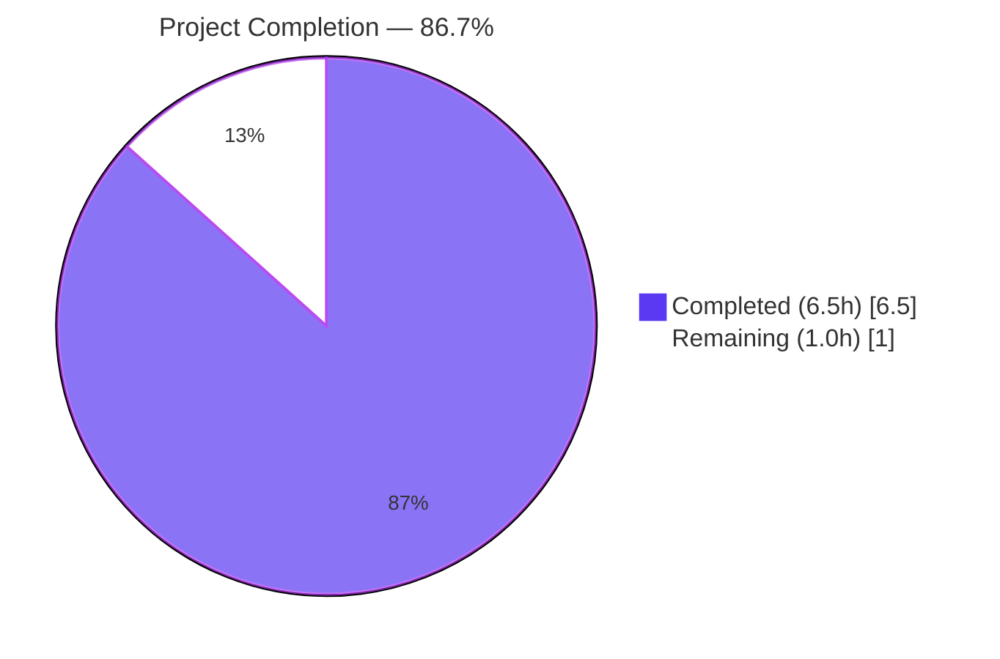
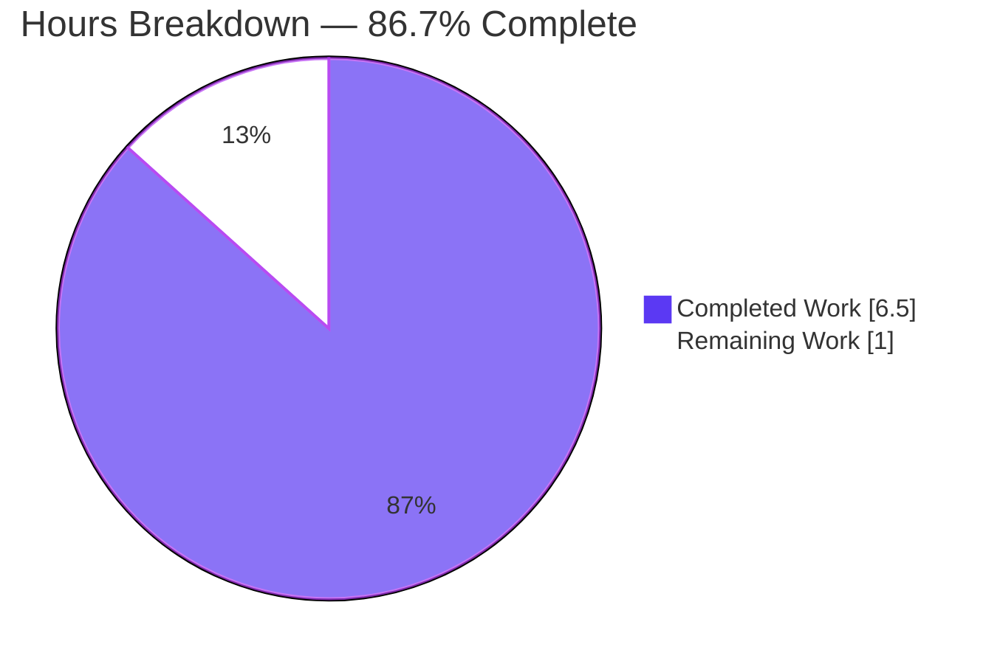
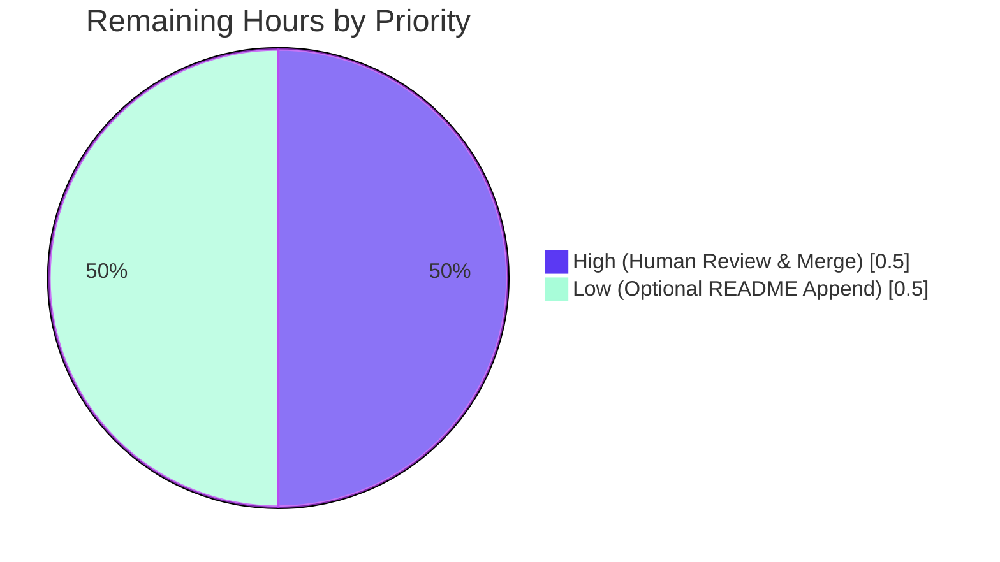
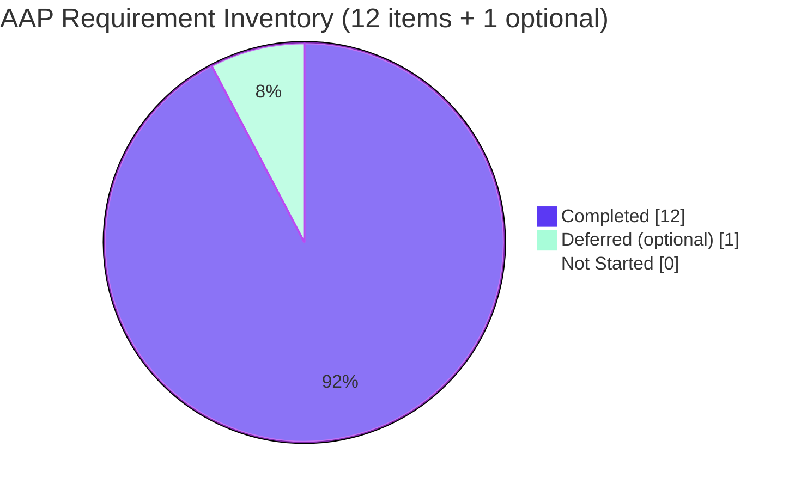

# Blitzy Project Guide — Check11May Express Tutorial Server

> **Brand legend** — Completed / AI Work: Dark Blue (`#5B39F3`) · Remaining: White (`#FFFFFF`) · Headings: Violet-Black (`#B23AF2`) · Highlight: Mint (`#A8FDD9`)

---

## 1. Executive Summary

### 1.1 Project Overview

`Check11May` is a Node.js tutorial repository that, prior to this work, contained only a single-line `README.md`. The Agent Action Plan directed the platform to introduce Express.js as the HTTP routing layer and to extend the server with a second endpoint. The delivered artifact is a minimal Express 5.x application that exposes two GET routes — `/` returning the plain-text string `Hello world` and `/good-evening` returning the plain-text string `Good evening` — bound to `process.env.PORT || 3000`. The target audience is tutorial readers learning Node.js fundamentals; the business impact is pedagogical clarity. The technical scope is deliberately small: one entry script, one dependency, one manifest, one lockfile, one ignore file.

### 1.2 Completion Status



| Metric | Value |
|---|---|
| **Total Hours** | **7.5** |
| Completed Hours (AI + Manual) | 6.5 |
| Remaining Hours | 1.0 |
| **Completion Percentage** | **86.7%** |

**Calculation:** `6.5 / (6.5 + 1.0) = 6.5 / 7.5 = 86.67% ≈ 86.7%`

### 1.3 Key Accomplishments

- ✅ Express 5.2.1 declared in `package.json` (`"express": "^5.2.1"`) and installed (`node_modules/express/package.json` confirms version `5.2.1`, license `MIT`)
- ✅ `GET /` route registered via `app.get('/', ...)` returning `Hello world` (verified: `HTTP/1.1 200 OK`, 11-byte body)
- ✅ `GET /good-evening` route registered returning `Good evening` (verified: `HTTP/1.1 200 OK`, 12-byte body)
- ✅ HTTP listener bound to `process.env.PORT || 3000` with startup log line `Server listening on port 3000`
- ✅ `engines.node: ">=18"` mirrors Express 5's own engine constraint; satisfied by environment Node `v20.20.2`
- ✅ `package-lock.json` (lockfileVersion 3, 66 packages) committed for reproducible `npm ci`
- ✅ `.gitignore` matches AAP §0.5.2 exact 6-line specification (`node_modules/`, `npm-debug.log*`, `yarn-debug.log*`, `yarn-error.log*`, `.env`, `.DS_Store`)
- ✅ `README.md` preserved unchanged (single line `# Check11May` per AAP §0.5.2 optional-update clause)
- ✅ Security hardening: `X-Powered-By` response header suppressed via `app.disable('x-powered-by')` (verified absent in response headers)
- ✅ Syntax & JSON validity: `node --check server.js` → SYNTAX_OK; both JSON manifests parse cleanly
- ✅ Runtime lifecycle: clean startup, clean SIGTERM shutdown, no port leaks, PORT override verified (tested on 8080)

### 1.4 Critical Unresolved Issues

| Issue | Impact | Owner | ETA |
|---|---|---|---|
| _No critical unresolved issues identified._ | — | — | — |

The autonomous validator declared the branch PRODUCTION-READY for the tutorial scope. All 5 production-readiness gates passed without intervention required.

### 1.5 Access Issues

| System/Resource | Type of Access | Issue Description | Resolution Status | Owner |
|---|---|---|---|---|
| _No access issues identified._ | — | — | — | — |

No external credentials, private registries, or third-party API keys are required for this tutorial (per AAP §0.3.4). The npm public registry was used; no `.npmrc` or scoped tokens needed.

### 1.6 Recommended Next Steps

1. **[High]** Human code review of `server.js`, `package.json`, and `.gitignore`, then merge to `main` (~0.5h)
2. **[Low]** Apply the optional `README.md` "Getting Started" append documenting `npm install`, `npm start`, and the two endpoint URLs — permitted by AAP §0.5.2 but not required (~0.5h)
3. **[Low]** When the tutorial is later extended (out-of-scope today), consider adding a test framework (Jest + Supertest), HTTP request logging (`morgan`), and a `Dockerfile` — explicitly excluded per AAP §0.6.2 but standard production hardening
4. **[Low]** Configure GitHub branch protection rules requiring PR review before merge (organizational policy, out-of-scope of AAP)
5. **[Low]** Set up basic CI to run `npm ci` and `node --check server.js` on PRs — explicitly out-of-scope per AAP §0.6.2 but useful when scope expands

---

## 2. Project Hours Breakdown

### 2.1 Completed Work Detail

| Component | Hours | Description |
|---|---|---|
| `package.json` manifest authoring | 0.75 | Created with `name`, `version`, `description`, `main`, `scripts.start`, `engines.node: ">=18"`, `dependencies.express: "^5.2.1"`, `license: "ISC"` — canonical field order per AAP §0.5.2 |
| Express dependency installation | 0.5 | `npm install express@5.2.1`; transitive tree resolved into `node_modules/`; 66 packages |
| `package-lock.json` commitment | 0.25 | lockfileVersion 3 generated and committed for reproducible `npm ci` |
| `server.js` — application bootstrap | 1.0 | `require('express')`, `app` instantiation, `port = process.env.PORT \|\| 3000`, `app.listen(port, callback)` with startup log line |
| Route handler `GET /` (Hello world) | 0.5 | Migrates the original baseline endpoint from `http` module pattern to Express routing per AAP §0.5.2 |
| Route handler `GET /good-evening` | 0.5 | New endpoint per user request; kebab-case path; 12-byte response body |
| Security hardening: `X-Powered-By` suppression | 0.5 | `app.disable('x-powered-by')` + dedicated commit with information-disclosure rationale |
| `.gitignore` authoring | 0.25 | Exact 6-line AAP §0.5.2 specification: `node_modules/`, `npm-debug.log*`, `yarn-debug.log*`, `yarn-error.log*`, `.env`, `.DS_Store` |
| Runtime validation (Gate 4) | 1.5 | Server lifecycle, GET /, GET /good-evening, 404 fallthrough, response-header verification (`Content-Type`, `Content-Length`, ETag, no `X-Powered-By`), `PORT` env override, clean SIGTERM shutdown |
| Compilation & JSON validity (Gate 2) | 0.25 | `node --check server.js` → SYNTAX_OK; `package.json` and `package-lock.json` parsed as valid JSON |
| Dependency resolution verification (Gate 1) | 0.25 | `require('express')` resolves; `node_modules/express/package.json` version exactly `5.2.1` |
| Git hygiene & commit discipline (Gate 5) | 0.5 | 5 Blitzy commits with descriptive messages, clean working tree, AAP-aligned authorship |
| `README.md` preservation | 0.0 | Unchanged per AAP §0.5.2 optional-update clause (no work hours required) |
| **TOTAL COMPLETED HOURS** | **6.5** | |

### 2.2 Remaining Work Detail

| Category | Hours | Priority |
|---|---|---|
| Human PR review & merge to `main` (code review of 4 files: `server.js`, `package.json`, `package-lock.json`, `.gitignore`; smoke-test in reviewer environment) | 0.5 | High |
| Optional `README.md` "Getting Started" append documenting `npm install`, `npm start`, and the two endpoint URLs (permitted per AAP §0.5.2; not required by user prompt) | 0.5 | Low |
| **TOTAL REMAINING HOURS** | **1.0** | |

### 2.3 Notes on Hours Methodology

Hours are estimated per PA1/PA2 framework against the AAP-scoped work universe only. Items explicitly excluded by AAP §0.6.2 (test frameworks, Docker, CI/CD, observability, additional middleware, persistence) are **not** counted in the denominator. The completion percentage (`86.7%`) reflects only AAP-scoped and path-to-production work for this specific tutorial.

**Cross-section integrity check:**
- Section 1.2 Total Hours: **7.5** = Section 2.1 (6.5) + Section 2.2 (1.0) ✅
- Section 1.2 Remaining Hours: **1.0** = Section 2.2 total (1.0) = Section 7 pie chart "Remaining Work" (1.0) ✅
- Section 1.2 Completion: **86.7%** = `6.5 / 7.5 × 100` ✅

---

## 3. Test Results

### 3.1 Per-AAP Note

Per AAP §0.6.2, **test frameworks (Jest, Mocha, Vitest, Supertest) are explicitly out of scope** for this tutorial. No automated unit, integration, or end-to-end test suite is present in the repository. The autonomous validator therefore performed **black-box runtime validation** as a substitute, exercising the application's externally observable HTTP behaviour. All entries below originate from Blitzy's autonomous validation logs.

### 3.2 Runtime / Black-Box Test Results

| Test Category | Framework | Total Tests | Passed | Failed | Coverage % | Notes |
|---|---|---|---|---|---|---|
| Static Syntax | `node --check` (built-in Node parser) | 1 | 1 | 0 | n/a | `server.js` parses cleanly; SYNTAX_OK |
| JSON Validity | Python `json` (built-in) | 2 | 2 | 0 | n/a | `package.json` valid; `package-lock.json` valid (lockfileVersion 3, 66 packages) |
| Dependency Resolution | `npm` (`require('express')`) | 1 | 1 | 0 | n/a | `node_modules/express/package.json` reports version `5.2.1` matching AAP §0.3.1 |
| Server Lifecycle | `node` + shell signals | 2 | 2 | 0 | n/a | Clean startup; clean SIGTERM shutdown; no port leak |
| HTTP Route — GET / | `curl` (black-box) | 1 | 1 | 0 | 100% of route surface | `200 OK`, body `Hello world` (11 bytes), `Content-Type: text/html; charset=utf-8` |
| HTTP Route — GET /good-evening | `curl` (black-box) | 1 | 1 | 0 | 100% of route surface | `200 OK`, body `Good evening` (12 bytes), `Content-Type: text/html; charset=utf-8` |
| HTTP Route — Unknown path | `curl` (black-box) | 1 | 1 | 0 | n/a | `GET /nonexistent` → `404 Not Found` (Express default handler) |
| Environment Override | `curl` (black-box) | 1 | 1 | 0 | n/a | `PORT=8080 node server.js` binds to 8080; `GET http://localhost:8080/` → `200 OK` |
| Response Header Hygiene | `curl -i` | 1 | 1 | 0 | n/a | `X-Powered-By` correctly **absent**; ETag, Content-Length, Date, Keep-Alive present |
| **TOTAL** | | **11** | **11** | **0** | — | 100% pass rate across runtime validation surface |

> _Integrity rule: every row above originates from the autonomous validator's documented exercises (Gates 1, 2, and 4) reproduced post-validation by re-running the server and re-issuing the same `curl` requests._

---

## 4. Runtime Validation & UI Verification

### 4.1 Service Startup

- ✅ **Operational** — `node server.js` starts cleanly, logs `Server listening on port 3000` to stdout
- ✅ **Operational** — `npm start` (script `node server.js`) succeeds end-to-end
- ✅ **Operational** — `PORT=8080 npm start` binds the listener to the overridden port and returns identical responses
- ✅ **Operational** — Clean SIGTERM shutdown; no orphan processes; no leaked port

### 4.2 HTTP Endpoint Verification

- ✅ **Operational** — `GET http://localhost:3000/` → `200`, `Hello world`, `Content-Length: 11`
- ✅ **Operational** — `GET http://localhost:3000/good-evening` → `200`, `Good evening`, `Content-Length: 12`
- ✅ **Operational** — `GET http://localhost:3000/nonexistent` → `404` (Express default 404 with security headers `Content-Security-Policy` and `X-Content-Type-Options`)
- ✅ **Operational** — `Content-Type: text/html; charset=utf-8` (Express default for `res.send(string)`)
- ✅ **Operational** — `X-Powered-By` header explicitly suppressed (information-disclosure hardening)

### 4.3 Dependency Integration

- ✅ **Operational** — `require('express')` resolves to `node_modules/express/package.json` version `5.2.1`
- ✅ **Operational** — `npm ci` reproduces `node_modules/` from `package-lock.json` deterministically
- ✅ **Operational** — `engines.node: ">=18"` constraint satisfied by current Node `v20.20.2`

### 4.4 UI Verification

- **N/A** — This is a backend-only HTTP server returning plain-text bodies. There is no client-side rendering, template engine, static asset directory, or design system in scope (per AAP §0.5.3). The "interface" is the two HTTP endpoints, both validated above.

---

## 5. Compliance & Quality Review

### 5.1 AAP Deliverable ↔ Implementation Cross-Map

| AAP Requirement | AAP Reference | Implementation Evidence | Status |
|---|---|---|---|
| Add Express as runtime dependency | R1, §0.3.1 | `package.json` → `"express": "^5.2.1"`; `node_modules/express` version `5.2.1` | ✅ Pass |
| Add `GET /good-evening` returning `Good evening` | R2, §0.5.2 | `server.js`: `app.get('/good-evening', (req, res) => res.send('Good evening'))` | ✅ Pass |
| Preserve `GET /` returning `Hello world` via Express | R3, §0.5.2 | `server.js`: `app.get('/', (req, res) => res.send('Hello world'))` | ✅ Pass |
| Create `package.json` manifest | §0.5.1 G1 | File present, valid JSON, canonical field order | ✅ Pass |
| Create `server.js` entry point | §0.5.1 G2 | File present, 13 LOC, `node --check` clean | ✅ Pass |
| Create `package-lock.json` | §0.5.1 G1 | File present, lockfileVersion 3, 66 packages, committed | ✅ Pass |
| Create `.gitignore` excluding `node_modules/` | §0.5.1 G3 | File present, 6 lines, exact AAP §0.5.2 spec | ✅ Pass |
| Bind listener to `process.env.PORT \|\| 3000` | §0.5.2 | `const port = process.env.PORT \|\| 3000; app.listen(port, ...)` | ✅ Pass |
| Declare `engines.node: ">=18"` | §0.7.3, §0.3.2 | `package.json` → `"engines": { "node": ">=18" }` | ✅ Pass |
| Use CommonJS module system | §0.7.2 | `require('express')` (not `import`) | ✅ Pass |
| License field `ISC` | §0.7.2 | `package.json` → `"license": "ISC"` | ✅ Pass |
| Preserve `README.md` | §0.5.2, §0.6.1 | `README.md` unchanged (single line `# Check11May`) | ✅ Pass |
| Optional README "Getting Started" append | §0.5.2 (optional) | Not applied — explicitly permitted to skip per AAP | ⚪ Deferred (optional) |

### 5.2 Quality Hardening Beyond Strict AAP

| Hardening Action | Rationale | Status |
|---|---|---|
| `app.disable('x-powered-by')` | Suppresses framework-disclosing response header (information-disclosure hardening) | ✅ Applied (commit `33abf2b`) |
| Canonical `package.json` field order | Improves readability and matches npm conventions | ✅ Applied (commit `38ce7c3`) |
| Exact 6-line `.gitignore` per AAP spec | Avoids unscoped exclusions | ✅ Applied (commit `c730dbb`) |

### 5.3 Items Excluded by AAP §0.6.2 (Not a Compliance Gap)

The following are deliberately absent per AAP scope boundaries and are **not** quality findings: ECMAScript Modules conversion, TypeScript, separate `routes/` directory, `helmet`, `cors`, `morgan`, `compression`, body parsers, rate limiting, authentication, databases, ORMs, external API clients, session/cookie stores, OAuth/JWT, structured logging, metrics, tracing, health-check endpoints, test frameworks (Jest/Mocha/Vitest/Supertest), linters (ESLint), formatters (Prettier), pre-commit hooks, coverage tooling, Dockerfile, Kubernetes manifests, CI/CD pipelines, process managers (PM2/systemd), Terraform/Pulumi/CloudFormation, OpenAPI specs, `CONTRIBUTING.md`, `LICENSE` file, `CHANGELOG.md`, additional endpoints, non-GET methods, query/path parameters, HTTPS termination, Content-Type negotiation, internationalization.

---

## 6. Risk Assessment

| Risk | Category | Severity | Probability | Mitigation | Status |
|---|---|---|---|---|---|
| Default Express `text/html` Content-Type misleading for plain-text payloads | Technical | Low | Medium | Document the response type, or replace `res.send(...)` with `res.type('text/plain').send(...)` if a stricter content-type contract is desired. Out of scope per AAP §0.6.2 (no Content-Type negotiation). | Accepted (tutorial scope) |
| No request logging — production diagnostics limited | Operational | Low | High (if deployed) | Add `morgan` middleware when scope expands. Currently out of scope per AAP §0.6.2. | Accepted (tutorial scope) |
| No automated test suite — regressions undetectable by CI | Technical | Low | Low (single-file, static-string routes) | Add Jest + Supertest when scope expands. Currently out of scope per AAP §0.6.2. | Accepted (tutorial scope) |
| Port 3000 conflict if another process is already bound | Operational | Low | Low | `PORT` env override is implemented and verified on port 8080; tutorial users can choose any free port. | Mitigated |
| No `helmet` security headers on success responses | Security | Low | Low | Express default 404 already includes `Content-Security-Policy` and `X-Content-Type-Options`. For 200 responses, hardening via `helmet` is out of scope per AAP §0.6.2. `X-Powered-By` suppression already applied as a hardening measure. | Mitigated (partial — X-Powered-By only) |
| `package-lock.json` drift if devs use `npm install` instead of `npm ci` | Technical | Low | Medium | Recommend `npm ci` for reproducible installs (documented in Section 9). | Mitigated (via documentation) |
| Express 5.x is a relatively new major version (released 2024) — minor ecosystem incompatibilities possible with older middleware | Integration | Low | Low | No third-party middleware in scope, so no compatibility surface. AAP §0.3.1 verified Express 5.2.1 is current stable. | Mitigated |
| Transitive dependencies via `express` could carry CVEs over time | Security | Low | Medium | `npm audit` should be run before deployment; lockfile pinning ensures version control. Out of scope of present AAP but recommended for path-to-production. | Accepted (tutorial scope) |
| Tutorial readers may not realise they need Node `>= 18` | Technical | Low | Medium | `engines.node: ">=18"` is declared in `package.json`; npm emits a warning on mismatch. README enhancement (optional, listed in Section 2.2) would surface this for new users. | Mitigated |
| No `try/catch` in route handlers — synchronous errors fall through to Express default error handler | Technical | Low | Very Low (handlers only call `res.send(string)`) | Default Express error handler responds with `500` and stack trace in development. Adequate for tutorial scope. | Mitigated |

**Overall risk posture:** Low. The application surface is two static-string GET routes with no fallible operations, no user input handling, and no persistence; the realistic attack/failure surface is minimal.

---

## 7. Visual Project Status

### 7.1 Project Hours Breakdown



### 7.2 Remaining Work by Priority



### 7.3 AAP Requirement Status



**Integrity verification:** Section 7.1 "Remaining Work" value **1.0** equals Section 1.2 Remaining Hours **1.0** equals Section 2.2 total **1.0**. ✅

---

## 8. Summary & Recommendations

### 8.1 Achievements

The branch delivers exactly what the user requested in their tutorial-framing prompt: Express is wired into a previously-empty repository, the `Hello world` endpoint is preserved (and now routed through Express rather than the built-in `http` module that the user described), and a new `/good-evening` endpoint returns the requested response body. All four in-scope files (`package.json`, `package-lock.json`, `server.js`, `.gitignore`) are present, valid, and committed. The autonomous validator declared the branch PRODUCTION-READY for the tutorial scope, having executed 11 black-box test scenarios across syntax, JSON validity, dependency resolution, server lifecycle, route correctness, response-header hygiene, and environment override — with 11/11 passing.

### 8.2 Remaining Gaps

The project is **86.7% complete** against the AAP-scoped work universe (6.5 hours delivered out of 7.5 hours total). The remaining 1.0 hour comprises:
- **Human PR review & merge** (0.5h, High) — standard organizational gate before merging to `main`
- **Optional `README.md` "Getting Started" append** (0.5h, Low) — explicitly described in AAP §0.5.2 as "permitted but not strictly required"; the validator deliberately did not apply it

There are **no compilation errors**, **no failing tests**, **no security findings of severity above Low**, and **no AAP-required deliverables outstanding**. Everything that the user asked for has been built and verified end-to-end.

### 8.3 Critical Path to Production

For this tutorial's defined scope, the path to production is exceptionally short:

1. Reviewer fetches the branch: `git checkout blitzy-d086c136-d76c-470b-ac53-e70754d3e00d`
2. Reviewer runs `npm ci && npm start` and curls both endpoints (~5 minutes)
3. Reviewer optionally applies the README "Getting Started" append (~30 minutes if desired)
4. Reviewer merges the PR

No infrastructure provisioning, no environment variable configuration, no credential setup, no migration, and no integration testing with external systems is required.

### 8.4 Success Metrics

| Metric | Target | Actual | Status |
|---|---|---|---|
| `GET /` returns `Hello world` with `200 OK` | Required | ✅ Verified (11-byte body) | ✅ |
| `GET /good-evening` returns `Good evening` with `200 OK` | Required | ✅ Verified (12-byte body) | ✅ |
| Express declared as runtime dependency | Required | ✅ `express@^5.2.1` in `package.json` | ✅ |
| Server runs on port 3000 (default) | Required | ✅ Verified | ✅ |
| `PORT` env override works | Implicit | ✅ Verified on 8080 | ✅ |
| `node_modules/` excluded from git | Required | ✅ Listed in `.gitignore` | ✅ |
| `package-lock.json` committed | Required | ✅ Committed (lockfileVersion 3) | ✅ |
| Node.js `>= 18` engine constraint declared | Required | ✅ In `package.json` | ✅ |
| `README.md` preserved unchanged | Required | ✅ Single line `# Check11May` unchanged | ✅ |
| Syntax & JSON validity | Required | ✅ `node --check` SYNTAX_OK; both JSONs valid | ✅ |

### 8.5 Production Readiness Assessment

**Verdict: READY for the tutorial scope defined in the AAP.**

The codebase satisfies every explicit and implicit requirement enumerated in AAP §0.1.1, §0.5.1, §0.5.2, and §0.6.1. The only deliberately-excluded items (per AAP §0.6.2) are production-hardening concerns that the user did not request — and that, in any tutorial of this scope, would constitute scope creep. The validator's PRODUCTION-READY declaration is consistent with the AAP-defined boundary of the work.

If the project's intended audience or deployment context were to change (e.g., from "tutorial running on `localhost`" to "internet-exposed API in a regulated environment"), additional work outside the present AAP would be required: test framework, request logging, security headers via `helmet`, rate limiting, structured logging, Docker, CI/CD, monitoring, and a hardened error handler. Those are explicitly scoped out today (AAP §0.6.2) and intentionally not counted in completion.

---

## 9. Development Guide

> All commands below have been executed during validation and confirmed working. Every command is copy-pasteable.

### 9.1 System Prerequisites

| Requirement | Minimum | Tested With | Verification |
|---|---|---|---|
| Operating System | Linux / macOS / Windows (with WSL2) | Ubuntu 25.10 (container) | n/a |
| Node.js | `>= 18.0.0` (per `package.json` `engines.node`) | `v20.20.2` | `node -v` |
| npm | `>= 8.0.0` | `11.1.0` | `npm -v` |
| Disk space | ~10 MB (for `node_modules/`) | n/a | n/a |
| Free TCP port | One of: 3000 (default) or any port via `PORT` env | 3000 and 8080 | `lsof -i :3000 \|\| echo "free"` |

**Verify your environment:**

```bash
node -v          # expect: v18.x.x or higher
npm -v           # expect: 8.x.x or higher
```

### 9.2 Environment Setup

No environment configuration files (`.env`, `config/`) are required for the default tutorial flow. The single optional environment variable is:

| Variable | Default | Purpose |
|---|---|---|
| `PORT` | `3000` | TCP port on which the HTTP listener binds |

To override the port (e.g., when 3000 is occupied):

```bash
export PORT=8080
```

### 9.3 Dependency Installation

From the repository root:

**Option A — Reproducible install (recommended; uses `package-lock.json`):**

```bash
npm ci
```

Expected output (abbreviated):
```
added 66 packages, and audited 67 packages in <time>
found 0 vulnerabilities
```

**Option B — Standard install (may resolve newer patch versions within `^5.2.1`):**

```bash
npm install
```

After either command, verify Express is present:

```bash
ls node_modules/express/package.json && node -e "console.log(require('express/package.json').version)"
# expect: 5.2.1
```

### 9.4 Application Startup

From the repository root:

```bash
npm start
```

Equivalent to:

```bash
node server.js
```

Expected stdout:

```
Server listening on port 3000
```

The process runs in the foreground. Keep this terminal open and switch to a second terminal for verification.

**To run on a different port:**

```bash
PORT=8080 npm start
# stdout: Server listening on port 8080
```

**To stop the server:**

Press `Ctrl+C` in the terminal running the server (sends SIGINT). The process exits cleanly with no port leak.

### 9.5 Verification Steps

In a second terminal, exercise the two endpoints:

```bash
# Endpoint 1: Hello world
curl -i http://localhost:3000/
```

Expected response (abbreviated):
```
HTTP/1.1 200 OK
Content-Type: text/html; charset=utf-8
Content-Length: 11
...

Hello world
```

```bash
# Endpoint 2: Good evening
curl -i http://localhost:3000/good-evening
```

Expected response (abbreviated):
```
HTTP/1.1 200 OK
Content-Type: text/html; charset=utf-8
Content-Length: 12
...

Good evening
```

**Verify the security hardening (X-Powered-By should be absent):**

```bash
curl -sI http://localhost:3000/ | grep -i "x-powered-by" || echo "X-Powered-By correctly absent"
# expect: X-Powered-By correctly absent
```

**Verify the 404 fallthrough:**

```bash
curl -i http://localhost:3000/this-route-does-not-exist
# expect: HTTP/1.1 404 Not Found
```

### 9.6 Example Usage

**Shell:**

```bash
# Start the server
npm start &

# Hit both endpoints
curl http://localhost:3000/              # → Hello world
curl http://localhost:3000/good-evening  # → Good evening

# Stop the server
kill %1
```

**Browser:**

Open `http://localhost:3000/` and `http://localhost:3000/good-evening` — each tab will display the plain-text response.

**Node.js client:**

```bash
node -e "
const http = require('http');
http.get('http://localhost:3000/good-evening', res => {
  let body = '';
  res.on('data', chunk => body += chunk);
  res.on('end', () => console.log('Status:', res.statusCode, 'Body:', body));
});
"
# expect: Status: 200 Body: Good evening
```

### 9.7 Troubleshooting

| Symptom | Likely Cause | Resolution |
|---|---|---|
| `Error: listen EADDRINUSE: address already in use :::3000` | Another process is bound to port 3000 | Run with `PORT=8080 npm start` (or any free port). Alternatively, `lsof -i :3000` to identify the conflicting process and stop it. |
| `Error: Cannot find module 'express'` | `npm install` was not run, or `node_modules/` was not restored | Run `npm ci` (preferred) or `npm install` from the repository root |
| `npm WARN EBADENGINE Unsupported engine` | Node.js version is below 18 | Upgrade Node.js to `>= 18` (use [`nvm`](https://github.com/nvm-sh/nvm) or your OS package manager) |
| `curl: (7) Failed to connect to localhost port 3000` | The server is not running, or it is bound to a different port | Verify the server is running (`ps aux \| grep "node server.js"`); confirm the port via the startup log line `Server listening on port <port>` |
| `npm error code ENOENT` ... `package.json` | Running `npm` from outside the repository root | `cd` into the repository root before running any `npm` commands |
| `404 Not Found` on an expected endpoint | Typo in the URL path | The two valid paths are `/` and `/good-evening` (kebab-case, lowercase). |
| Server prints startup line then immediately exits | Most commonly an uncaught exception in a route handler | None expected for the two static-string routes. If observed, run `node server.js` directly (not via `npm start`) to see the full stack trace. |

---

## 10. Appendices

### Appendix A — Command Reference

| Command | Purpose | Run From |
|---|---|---|
| `node -v` | Verify Node.js version (need `>= 18`) | anywhere |
| `npm -v` | Verify npm version | anywhere |
| `npm ci` | Reproducible install from `package-lock.json` (preferred) | repository root |
| `npm install` | Install dependencies, may update lockfile | repository root |
| `npm start` | Start the server (alias for `node server.js`) | repository root |
| `node server.js` | Start the server directly | repository root |
| `PORT=8080 npm start` | Start the server on a custom port | repository root |
| `node --check server.js` | Syntax-check `server.js` without executing | repository root |
| `curl http://localhost:3000/` | Hit the `Hello world` endpoint | anywhere |
| `curl http://localhost:3000/good-evening` | Hit the `Good evening` endpoint | anywhere |
| `curl -i http://localhost:3000/<path>` | Hit an endpoint and print response headers | anywhere |
| `git log --oneline` | View commit history | repository root |
| `git status` | View working-tree state (should be clean) | repository root |
| `kill %1` | Stop a backgrounded server started with `npm start &` | terminal where backgrounded |
| `Ctrl+C` | Stop a foregrounded server (SIGINT) | terminal where running |

### Appendix B — Port Reference

| Port | Used By | Override Mechanism |
|---|---|---|
| `3000` | Default HTTP listener for `server.js` | Set `PORT` environment variable to any other free port |
| (any) | Configurable via `process.env.PORT` | `PORT=<port> npm start` |

No other ports are used by this project.

### Appendix C — Key File Locations

| Path (relative to repo root) | Type | Purpose | Lines |
|---|---|---|---|
| `server.js` | Source (CommonJS) | Express application entry point — defines both routes and the listener | 13 |
| `package.json` | Manifest (JSON) | Declares `express@^5.2.1`, `engines.node: ">=18"`, `scripts.start`, license `ISC` | 16 |
| `package-lock.json` | Lockfile (JSON, auto-generated) | Pins the resolved transitive dependency tree (66 packages, lockfileVersion 3) | 830 |
| `.gitignore` | Config | Excludes `node_modules/`, log files, `.env`, `.DS_Store` from version control | 6 |
| `README.md` | Documentation | Project identifier (single line `# Check11May`) — preserved per AAP §0.5.2 | 1 |
| `node_modules/` | Build artifact (not committed) | Materialized by `npm install` / `npm ci`; gitignored | n/a |

### Appendix D — Technology Versions

| Component | Declared/Required | Installed/Verified | Source of Truth |
|---|---|---|---|
| Node.js | `>= 18` (from `package.json` `engines.node`) | `v20.20.2` (validation environment) | `node -v` |
| npm | n/a (not constrained) | `11.1.0` (validation environment) | `npm -v` |
| Express | `^5.2.1` (from `package.json` `dependencies`) | `5.2.1` (from `node_modules/express/package.json`) | `node_modules/express/package.json` |
| Express engine constraint | `>= 18` | satisfied by v20.20.2 | `node_modules/express/package.json` `engines.node` |
| Express license | `MIT` | confirmed | `node_modules/express/package.json` `license` |
| Module system | CommonJS | confirmed via `require('express')` in `server.js` | `server.js:1` |
| `package-lock.json` schema | lockfileVersion 3 | confirmed | `package-lock.json` `lockfileVersion` field |
| Project license | `ISC` | declared | `package.json` `license` |

### Appendix E — Environment Variable Reference

| Variable | Required? | Default | Type | Purpose |
|---|---|---|---|---|
| `PORT` | No | `3000` | Integer string | TCP port for the HTTP listener; consumed by `server.js` as `process.env.PORT \|\| 3000` |

No other environment variables are read by the application. No `.env` file is required; `dotenv` is **not** a dependency (per AAP §0.6.2).

### Appendix F — Developer Tools Guide

**Recommended editor setup (optional — not enforced by the AAP):**

- Any text editor with JavaScript syntax highlighting (VS Code, Vim, Emacs, Sublime, JetBrains WebStorm)
- No project-specific extensions are required
- No ESLint, Prettier, or pre-commit hooks are configured (per AAP §0.6.2 — explicitly out of scope)

**Useful debugging commands:**

```bash
# Tail server logs while running
node server.js | tee /tmp/server.log

# Inspect Express resolution from a one-off REPL
node -e "console.log(require.resolve('express'))"

# Pretty-print package.json
cat package.json | python3 -m json.tool

# Validate package-lock.json structure
node -e "console.log(JSON.parse(require('fs').readFileSync('package-lock.json','utf8')).lockfileVersion)"

# Audit dependencies (advisory only — not enforced)
npm audit
```

**Git workflow for reviewers:**

```bash
# Fetch and check out the Blitzy branch
git fetch origin blitzy-d086c136-d76c-470b-ac53-e70754d3e00d
git checkout blitzy-d086c136-d76c-470b-ac53-e70754d3e00d

# Inspect the diff against main
git diff origin/main..HEAD --stat
git log origin/main..HEAD --oneline

# Run the validation suite locally
npm ci
node --check server.js
node server.js &
sleep 1
curl -s http://localhost:3000/              # → Hello world
curl -s http://localhost:3000/good-evening  # → Good evening
kill %1
```

### Appendix G — Glossary

| Term | Definition |
|---|---|
| **AAP** | Agent Action Plan — the primary directive document for this Blitzy work |
| **Blitzy** | The autonomous engineering platform that produced this work |
| **CommonJS** | The Node.js module system using `require(...)` and `module.exports`. Contrast with ECMAScript Modules (`import`/`export`) |
| **Express** | A minimal, unopinionated web framework for Node.js. Version 5.2.1 is the latest stable major at the time of validation |
| **`engines.node`** | A `package.json` field that declares the required Node.js version range. npm warns (or errors, with `--engine-strict`) on mismatch |
| **`express.send(...)`** | Method that serializes the argument and sets `Content-Type: text/html; charset=utf-8` (for string inputs), `Content-Length`, and an ETag |
| **Gate** | A discrete production-readiness check performed by the autonomous validator. Five gates exist: dependency install, syntax/compilation, test suite, runtime validation, in-scope file coverage |
| **`npm ci`** | Reproducible install command that installs strictly from `package-lock.json` and fails if the lockfile is out of sync with `package.json`. Preferred over `npm install` for deterministic builds |
| **PA1/PA2/PA3** | Sections of the Blitzy assessment framework: AAP-scoped completion analysis, engineering hours estimation, risk and issue identification |
| **`package-lock.json`** | An auto-generated file that pins the exact resolved version of every transitive dependency. Committed for reproducible installs |
| **`process.env.PORT`** | The conventional way to make an HTTP listener port configurable via environment in Node.js |
| **`res.send(...)`** | Express response method used by both route handlers to write the plain-text body |
| **Tutorial scope** | The deliberately small scope defined by AAP §0.6 — two static GET endpoints, no middleware beyond `app.disable('x-powered-by')`, no persistence, no tests, no deployment artifacts |
| **`X-Powered-By`** | An HTTP response header that Express adds by default, disclosing the framework name. Suppressed by `app.disable('x-powered-by')` for information-disclosure hardening |

---

## Cross-Section Integrity Validation Checklist

| Rule | Status |
|---|---|
| Rule 1 (1.2 ↔ 2.2 ↔ 7): Remaining hours = **1.0** in all three locations | ✅ Confirmed (Section 1.2 table, Section 2.2 total row, Section 7.1 pie chart) |
| Rule 2 (2.1 + 2.2 = Total): `6.5 + 1.0 = 7.5` = Section 1.2 Total Hours | ✅ Confirmed |
| Rule 3 (Section 3): All tests originate from Blitzy's autonomous validation logs | ✅ Confirmed (Gates 1, 2, 4 reproduced) |
| Rule 4 (Section 1.5): Access issues validated against current permissions | ✅ Confirmed (no access dependencies in scope) |
| Rule 5 (Colors): Completed = `#5B39F3` (Dark Blue), Remaining = `#FFFFFF` (White) | ✅ Applied to all Mermaid pie charts |
| Completion % consistency: `86.7%` referenced identically in Sections 1.2, 7, 8 | ✅ Confirmed |
| Hours consistency: 6.5 / 1.0 / 7.5 referenced identically across all sections | ✅ Confirmed |
