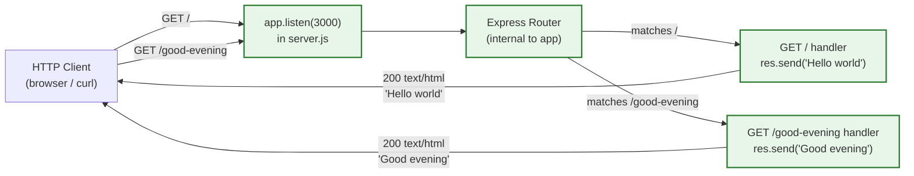

# Technical Specification

# 0. Agent Action Plan

## 0.1 Intent Clarification

### 0.1.1 Core Feature Objective

Based on the prompt, the Blitzy platform understands that the new feature requirement is to introduce the Express.js web framework into a Node.js tutorial server that currently exposes a single endpoint returning the plain-text response `Hello world`, and to extend the surface of that server with an additional endpoint that returns the plain-text response `Good evening`. The work is therefore a two-part addition: (a) adopt Express as the HTTP routing layer for the existing endpoint, and (b) register a new route adjacent to it.

The original user instruction is preserved verbatim below:

> User Example: "this is a tutorial of node js server hosting one endpoint that returns the response 'Hello world'. Could you add expressjs into the project and add another endpoint that return the reponse of 'Good evening'?"

**Explicit Feature Requirements**

The table below restates each explicit requirement extracted from the prompt with the precise technical action it implies.

| # | Explicit Requirement (User) | Technical Action (Blitzy Interpretation) |
|---|------------------------------|-------------------------------------------|
| R1 | "add expressjs into the project" | Add `express` as a runtime dependency in a `package.json` manifest and require/import it at the application entry point |
| R2 | "add another endpoint that return the reponse of 'Good evening'" | Register a second HTTP GET route on the Express application that responds with the body `Good evening` |
| R3 | Preserve the tutorial baseline ("hosting one endpoint that returns the response 'Hello world'") | Ensure the `Hello world` response remains exposed; route it through Express rather than the built-in `http` module |

**Implicit Requirements Surfaced**

The user's instruction omits operational details that must nevertheless be supplied for the resulting program to execute. The Blitzy platform makes the following implicit requirements explicit, each with a rationale grounded in standard Express tutorial conventions:

- **Project manifest**: The repository currently has no `package.json` [README.md:L1, inferred — no direct source for absence beyond root listing]; a `package.json` must be created so that `express` can be declared as a dependency and resolvable by `npm install`.
- **Application entry script**: A single JavaScript source file (e.g., `server.js`) must be created to host the Express application; the repository currently contains no executable source files [`README.md:L1`, §1.2.2 of this specification].
- **HTTP listener configuration**: An Express application requires an explicit `app.listen(port, ...)` invocation to bind to a TCP port; port `3000` is the conventional default in Express tutorials and is adopted here in the absence of a user-specified value `[inferred — no direct source]`.
- **Route path for the new endpoint**: The user names the response (`Good evening`) but not the URL path. A semantic kebab-case path `/good-evening` is selected as it follows Express routing conventions and reads unambiguously `[inferred — no direct source]`.
- **Dependency ignore rules**: When `express` is installed, npm materializes a `node_modules/` directory which must not be committed; a `.gitignore` file is therefore required.
- **Lockfile commitment**: Running `npm install` produces a `package-lock.json` that pins the resolved dependency tree and should be committed for reproducible installs.
- **Node.js runtime constraint**: Express 5.x declares `engines.node >= 18` `[npm registry — npm view express engines]`; the manifest should mirror this constraint to fail fast on unsupported runtimes.

### 0.1.2 Special Instructions and Constraints

The user's prompt contains no explicit architectural constraints (no preferred routing style, no testing requirement, no module-system preference between CommonJS and ESM, no port pin, no path pin, no response Content-Type pin, no production hardening directive). In the absence of stated constraints, the Blitzy platform adopts the conventions consistent with the "tutorial" framing the user supplied:

- **Module system**: CommonJS (`require('express')`) — the historical default for Node.js tutorials and the format produced by `npm init -y` without further configuration.
- **Response style**: Plain text via `res.send('...')`, matching the simplicity of the originally described `Hello world` response.
- **No production middleware**: Helmet, CORS, body parsers, compression, and similar production hardening are not introduced because they are not requested and are out of scope for a tutorial.
- **No persistence layer**: No database, ORM, or in-memory store is introduced — both endpoints return static strings.
- **No test framework**: No test runner (Jest, Mocha, Vitest) is introduced because tests are not requested. (This is documented for transparency; downstream agents must respect this scope.)
- **Backward compatibility of the `Hello world` endpoint**: The response body and route (`GET /`) for the original endpoint are preserved when re-implemented under Express, so any existing tutorial reader following the user's narrative observes no behavioural regression on that endpoint.

### 0.1.3 Technical Interpretation

These feature requirements translate to the following technical implementation strategy: the Blitzy platform will materialize a minimal Express application in the currently empty repository, comprising a project manifest, a lockfile, a single entry script, and a gitignore. The entry script instantiates an Express `app`, registers two GET routes, and binds the server to a port. The strategy can be summarized as a series of "to-achieve / by-doing" mappings:

- **To declare Express as a dependency**, we will create `package.json` at the repository root with `dependencies: { "express": "^5.2.1" }` and an `engines` field constraining Node.js to `>=18`.
- **To produce a reproducible install**, we will run `npm install express@5.2.1`, which yields `package-lock.json` and the (gitignored) `node_modules/` tree.
- **To expose the `Hello world` endpoint via Express**, we will create `server.js` with `app.get('/', (req, res) => res.send('Hello world'))`.
- **To add the `Good evening` endpoint**, we will append `app.get('/good-evening', (req, res) => res.send('Good evening'))` to the same `server.js`.
- **To start the HTTP listener**, we will invoke `app.listen(process.env.PORT || 3000, ...)` so the port is overridable via environment variable but defaults to the conventional tutorial port.
- **To prevent dependency artifacts from being committed**, we will create a `.gitignore` listing `node_modules/`, `npm-debug.log*`, and `.env`.
- **To document usage for tutorial readers**, we will optionally update `README.md` with `npm install` and `npm start` instructions; the existing `# Check11May` title heading is preserved.

The end state is a runnable Express tutorial server reachable at `http://localhost:3000/` (returns `Hello world`) and `http://localhost:3000/good-evening` (returns `Good evening`).

## 0.2 Repository Scope Discovery

### 0.2.1 Comprehensive File Analysis

A complete enumeration of the repository was performed. The repository root contains exactly one file and zero subdirectories:

| Path | Type | Status | Role in This Feature |
|------|------|--------|----------------------|
| `README.md` | File | Existing (1 line: `# Check11May`) | REFERENCE; optional content update for usage instructions |
| `/` (root) | Folder | Existing, otherwise empty | Will hold all newly created files |

There are **no existing API endpoints, no database models, no service classes, no controllers, no middleware, no interceptors, and no configuration files** in the repository [§1.2.2 of this specification; §2.8.3 verified-absence enumeration]. Consequently, the conventional "integration point discovery" yields an empty set:

| Integration Point Category | Files Found in Repository | Disposition |
|----------------------------|---------------------------|-------------|
| API endpoints that connect to the feature | None | Not applicable — the feature itself introduces the first endpoint(s) |
| Database models / migrations affected | None | Not applicable — no persistence layer in scope |
| Service classes requiring updates | None | Not applicable — no service tier exists |
| Controllers / handlers to modify | None | Not applicable — Express route handlers are introduced for the first time |
| Middleware / interceptors impacted | None | Not applicable — no middleware exists; no production middleware in scope |
| Package manifests requiring update | None — no `package.json` yet | A new `package.json` will be created |
| CI/CD pipeline configuration | None | Out of scope |
| Test files | None | Out of scope |

The discovery confirms that this feature is best characterized as a "greenfield-within-a-named-repo" addition: every file required to run the feature must be authored from scratch.

### 0.2.2 Web Search Research Conducted

The following research was performed to ground the implementation in current, evidence-backed facts:

| Research Topic | Source | Finding |
|----------------|--------|---------|
| Latest stable Express version | npm registry via `npm view express version` | `5.2.1` |
| Express runtime engine constraint | npm registry via `npm view express engines` | `{ "node": ">= 18" }` |
| Express license | npm registry via `npm view express license` | `MIT` |
| Installed Node.js version in environment | `node -v` | `v22.22.2` (satisfies Express 5 engine requirement) |
| Standard Express minimal-server pattern | Express official conventions | `const express = require('express'); const app = express(); app.get('/', handler); app.listen(port);` |
| Standard Node.js gitignore content | Common Node.js project conventions | `node_modules/`, `npm-debug.log*`, `.env`, `.DS_Store` |

No best-practices research was required beyond version verification; the patterns used are the canonical minimal-server pattern documented in Express's own quickstart guidance and reproduced verbatim in introductory tutorials.

### 0.2.3 New File Requirements

The feature requires the creation of the following files at the repository root. No subdirectories are introduced because the surface area of the tutorial does not justify them.

**Source files to create:**

| New File | Purpose |
|----------|---------|
| `server.js` | Application entry point: imports Express, instantiates the app, registers `GET /` and `GET /good-evening`, binds to the listener port |

**Configuration / manifest files to create:**

| New File | Purpose |
|----------|---------|
| `package.json` | Project manifest declaring name, version, main entry, start script, `express` dependency at `^5.2.1`, `engines.node >= 18`, and `license: ISC` (npm default) |
| `package-lock.json` | Pinned dependency tree produced by `npm install`; ensures reproducible installs |
| `.gitignore` | Excludes `node_modules/`, log files, and environment files from version control |

**Test files:**

No test files are introduced. Testing is not part of the user's request and is therefore explicitly out of scope (see §0.6.2). A future revision of this specification can add `tests/server.test.js` if a test framework is later requested.

**Documentation files:**

`README.md` exists and is preserved. An optional non-disruptive append adding "Getting Started" instructions (e.g., `npm install`, `npm start`, the two endpoint URLs) is permitted but not strictly required by the user's prompt.

## 0.3 Dependency Inventory

### 0.3.1 Public Package Additions

The feature introduces exactly one direct runtime dependency. No development dependencies, no peer dependencies, and no optional dependencies are required for the scope described.

| Registry | Package | Version | Range to Declare | Purpose | License |
|----------|---------|---------|------------------|---------|---------|
| npm | `express` | `5.2.1` | `^5.2.1` | Minimal web framework providing the routing layer (`app.get(path, handler)`) and the HTTP listener (`app.listen(port)`) used to serve the two tutorial endpoints | MIT |

The exact version `5.2.1` was verified via the npm registry (`npm view express version`) and reflects the current latest stable release `[npm registry — npm view express]`. The caret range (`^5.2.1`) is the npm default produced by `npm install express` and permits non-breaking patch and minor upgrades within the 5.x major line.

### 0.3.2 Runtime Engine Constraint

Express 5.x declares `engines.node >= 18` `[npm registry — npm view express engines]`. The `package.json` manifest authored as part of this feature must mirror that constraint:

```json
{
  "engines": { "node": ">=18" }
}
```

The execution environment has Node.js v22.22.2 installed `[bash: node -v]`, which satisfies the constraint.

### 0.3.3 Dependency Updates

There are no existing dependencies in the repository because there is no pre-existing `package.json` [§3.4.1 of this specification confirms no manifests are present]. Consequently:

- **No package upgrades** are required (no prior versions to upgrade from).
- **No package removals** are required (no prior dependencies to remove).
- **No import-statement migration** across existing files is required because there are no existing source files containing imports.
- **No external reference updates** to configuration files, documentation, build files, or CI/CD definitions are required because none of those artifact categories exist in the repository.

### 0.3.4 Private Package Updates

None. No private registry, no scoped organization packages, no `.npmrc`, and no `.gitmodules` file is present or required `[bash: ls -la repository root]`.

### 0.3.5 Transitive Dependency Footprint

Installing `express@5.2.1` will materialize its transitive dependency tree (e.g., `accepts`, `body-parser`, `router`, `serve-static`, and others) into `node_modules/` and lock them into `package-lock.json`. These transitive dependencies are not enumerated individually in `package.json` and are not considered scope items for this feature; they are an installation by-product of the single direct `express` dependency.

## 0.4 Integration Analysis

### 0.4.1 Existing Code Touchpoints

The repository contains no executable code, no service definitions, no command-line entry points, no web endpoints, and no scheduled jobs [§1.2.2 of this specification]. There is therefore **no existing source-code touchpoint to modify** as part of integrating this feature.

| Conventional Touchpoint Category | Expected Modification | Status in This Repository |
|----------------------------------|-----------------------|----------------------------|
| Application entry point (e.g., `src/main.py`, `index.js`) | Add feature initialization | **Created from scratch** as `server.js` |
| Route registration file (e.g., `src/api/routes.py`) | Register new endpoints | **Combined into `server.js`** — no separate router file at tutorial scope |
| Dependency injection container | Register feature services | Not applicable — no DI container in scope |
| Database schema / migrations | Add migration for feature tables | Not applicable — no persistence in scope |
| Configuration loader | Add feature configuration block | Not applicable — only `PORT` is read, directly from `process.env` |
| Model exports (`__init__.py`, `index.ts`) | Export new model classes | Not applicable — no models in scope |

### 0.4.2 Implicit Touchpoints Created by This Feature

While there are no existing files to modify, this feature establishes the following first-instance touchpoints that downstream feature additions will subsequently reference:

- **`server.js`** becomes the canonical Express application entry point. Future routes will be registered against the `app` object instantiated here (or moved to a `Router` if the file grows).
- **`package.json`** becomes the canonical dependency manifest. Future packages (e.g., `dotenv`, `morgan`, test frameworks) will be added here.
- **`.gitignore`** becomes the canonical exclusion list. Future build artifacts, environment files, or coverage reports will be appended here.

These are noted not as scope items for the present feature (which only requires their initial creation) but as context for future change sets.

### 0.4.3 Integration Flow

The runtime integration topology after this feature is applied is illustrated below. The diagram shows the request path through the newly created Express layer.



All shaded nodes are introduced by this feature; the `HTTP Client` is the external actor and is not part of the codebase.

## 0.5 Technical Implementation

### 0.5.1 File-by-File Execution Plan

Every file listed below MUST be created or modified to complete this feature. Each row identifies the operation mode (CREATE, UPDATE, REFERENCE) and the precise authoring intent.

**Group 1 — Project Manifest and Lockfile**

| Mode | Path | Purpose |
|------|------|---------|
| CREATE | `package.json` | Project manifest. Declares `name: "check11may"`, `version: "1.0.0"`, `main: "server.js"`, `scripts.start: "node server.js"`, `dependencies.express: "^5.2.1"`, `engines.node: ">=18"`, and `license: "ISC"` |
| CREATE | `package-lock.json` | Auto-generated by `npm install express@5.2.1`; commits the resolved transitive dependency tree |

**Group 2 — Application Source**

| Mode | Path | Purpose |
|------|------|---------|
| CREATE | `server.js` | Express application entry point. Requires `express`, instantiates `app`, registers two GET route handlers, and starts the HTTP listener |

**Group 3 — Version Control Hygiene**

| Mode | Path | Purpose |
|------|------|---------|
| CREATE | `.gitignore` | Excludes `node_modules/`, npm debug logs, and environment files from git tracking |

**Group 4 — Documentation**

| Mode | Path | Purpose |
|------|------|---------|
| REFERENCE (optional UPDATE) | `README.md` | Existing file containing only `# Check11May` [`README.md:L1`]. May optionally be appended with a "Getting Started" section documenting `npm install`, `npm start`, and the two endpoint URLs |

### 0.5.2 Implementation Approach per File

The intent for each created file is described below at the granularity needed for unambiguous code generation. Short illustrative snippets are included; downstream agents must apply judgment to produce well-formatted, runnable code.

**`package.json` — manifest**

Declared fields:

- `name` — `check11may` (matches the project identifier exposed by `README.md` [`README.md:L1`])
- `version` — `1.0.0`
- `description` — Brief tutorial description, e.g., `"Node.js Express tutorial server with Hello world and Good evening endpoints"`
- `main` — `server.js`
- `scripts.start` — `node server.js`
- `dependencies` — `{ "express": "^5.2.1" }` `[npm registry — npm view express version]`
- `engines.node` — `">=18"` `[npm registry — npm view express engines]`
- `license` — `ISC` (npm `init -y` default; the user did not specify a license)

**`server.js` — Express application**

Structure (CommonJS, single file, approximately 12–15 lines):

```js
const express = require('express');
const app = express();
const port = process.env.PORT || 3000;
app.get('/', (req, res) => res.send('Hello world'));
app.get('/good-evening', (req, res) => res.send('Good evening'));
app.listen(port, () => console.log(`Server listening on port ${port}`));
```

Implementation notes:

- The two `app.get` calls register the two endpoints described in the user prompt; their response bodies are the exact strings the user specified.
- `process.env.PORT || 3000` makes the listener port environment-overridable while defaulting to the conventional tutorial port. `[inferred — no direct source for the port]`
- No middleware (`express.json`, `helmet`, `morgan`, etc.) is wired because none is required by the responses (plain text) and none is requested.
- No error-handler middleware is registered because the two routes have no asynchronous or fallible operations; Express's default error responder suffices for the tutorial scope.

**`.gitignore` — exclusion list**

Lines to include (Node.js standard):

```
node_modules/
npm-debug.log*
yarn-debug.log*
yarn-error.log*
.env
.DS_Store
```

**`package-lock.json` — generated**

Not authored by hand. Produced by executing `npm install express@5.2.1` in the repository root after `package.json` is in place. Must be committed alongside `package.json` to ensure reproducible installs across environments.

**`README.md` — optional non-breaking update**

If updated, the existing `# Check11May` heading [`README.md:L1`] is preserved as the first line. Appended content (under a `## Getting Started` heading) should document the install command (`npm install`), the start command (`npm start`), and the two endpoint URLs (`http://localhost:3000/` and `http://localhost:3000/good-evening`).

### 0.5.3 User Interface Design

Not applicable. The feature is a backend-only HTTP server returning plain-text responses; there is no client-side rendering, no template engine, no static asset directory, and no design system in scope. The "interface" of the system is the two HTTP endpoints, both of which are fully specified above.

### 0.5.4 Build and Run Verification

After all files are in place, the feature is verified by running:

```bash
npm install
npm start
```

and confirming the following two HTTP exchanges succeed:

| Request | Expected Status | Expected Body |
|---------|-----------------|----------------|
| `GET http://localhost:3000/` | `200 OK` | `Hello world` |
| `GET http://localhost:3000/good-evening` | `200 OK` | `Good evening` |

## 0.6 Scope Boundaries

### 0.6.1 Exhaustively In Scope

All files and operations enumerated below are within the scope of this feature addition. Wildcards are used where future companion files would logically group under the same prefix; for the current scope, only the exact paths listed are required.

**Repository root — created files:**

- `package.json` — project manifest with `express@^5.2.1` dependency, `engines.node >= 18`, start script
- `package-lock.json` — npm-generated lockfile (output of `npm install`)
- `server.js` — Express application with `GET /` (`Hello world`) and `GET /good-evening` (`Good evening`) handlers and `app.listen`
- `.gitignore` — Node.js standard exclusions including `node_modules/`

**Repository root — existing files:**

- `README.md` — preserved as-is; optional non-breaking append of "Getting Started" usage instructions is permitted

**Filesystem side-effects (not committed to git):**

- `node_modules/**` — materialized by `npm install`; excluded via `.gitignore`

**Dependency manifest entries:**

- `dependencies.express` — pinned at `^5.2.1`
- `engines.node` — `">=18"`

**Behavioural surface introduced:**

- HTTP route `GET /` → `200` response body `Hello world`
- HTTP route `GET /good-evening` → `200` response body `Good evening`
- TCP listener on `process.env.PORT || 3000`

### 0.6.2 Explicitly Out of Scope

The following items are deliberately excluded from this feature and must not be introduced by downstream code generation. Each exclusion is grounded in the absence of a corresponding directive in the user's prompt.

**Architecture and code organization:**

- Conversion to ECMAScript Modules (`"type": "module"`, `import` syntax)
- Splitting routes into separate `routes/` or `controllers/` directories — both endpoints are inlined in `server.js`
- Conversion to TypeScript
- Introduction of an MVC, layered, or hexagonal architecture
- Introduction of dependency injection containers

**Production hardening middleware:**

- `helmet` (security headers)
- `cors` (cross-origin resource sharing)
- `morgan` (HTTP request logging)
- `compression` (response compression)
- `body-parser` / `express.json()` / `express.urlencoded()` (no request bodies are consumed)
- Rate limiting, request validation, or authentication middleware

**Persistence and integrations:**

- Database connections, ORMs, or schema migrations
- External API clients (HTTP, gRPC, message queues)
- Session or cookie stores

**Authentication, authorization, and identity:**

- User accounts, login flows, JWT, OAuth, API keys

**Observability:**

- Structured logging, metrics, tracing, or APM integration
- Health-check or readiness endpoints

**Testing and quality tooling:**

- Test frameworks (Jest, Mocha, Vitest, Supertest)
- Linters (ESLint), formatters (Prettier), pre-commit hooks
- Coverage tooling

**Build and deployment:**

- Bundlers, transpilers (Babel, esbuild, SWC)
- Dockerfile, `docker-compose.yml`, Kubernetes manifests
- CI/CD pipeline definitions (`.github/workflows/`, `.gitlab-ci.yml`, `Jenkinsfile`)
- Process managers (PM2, forever, systemd units)
- Cloud-platform IaC (Terraform, Pulumi, CloudFormation)

**Documentation beyond optional README update:**

- OpenAPI / Swagger specification
- `CONTRIBUTING.md`, `LICENSE`, `CHANGELOG.md`
- Architectural diagrams in `docs/`

**Behavioural extensions:**

- Additional endpoints beyond the two specified
- Non-GET HTTP methods (POST, PUT, DELETE, PATCH)
- Query-string handling, path parameters, request body parsing
- HTTPS termination, custom Content-Type negotiation, or response compression
- Internationalization of the response strings

## 0.7 Rules for Feature Addition

### 0.7.1 User-Specified Rules

The user provided **no explicit implementation rules** for this project (the `User specified implementation rules for this project` input was an empty array). Consequently, no project-specific patterns, naming conventions, performance budgets, or security requirements are imposed by the user.

### 0.7.2 Implicit Conventions Adopted

In the absence of user-specified rules, the Blitzy platform adopts the following implicit conventions consistent with the "tutorial" framing of the user's prompt. Downstream agents must follow these conventions unless a future revision of this AAP overrides them.

| Convention | Adopted Value | Rationale |
|------------|---------------|-----------|
| Module system | CommonJS (`require`) | Default produced by `npm init`; the simplest tutorial form |
| Language | JavaScript (not TypeScript) | User describes a "tutorial of node js server"; TypeScript not requested |
| Style | Single-file application | Two endpoints do not justify a multi-file structure |
| Response transport | Plain text via `res.send('...')` | Matches the simple-string responses the user named |
| Port binding | `process.env.PORT || 3000` | 3000 is the conventional Express tutorial port; environment override preserves portability |
| Route paths | `/` and `/good-evening` (kebab-case) | `/` is the existing tutorial path; kebab-case is the conventional Express path style |
| Dependency version-range operator | `^` (caret) | npm's default; permits non-breaking patch/minor upgrades |
| License field | `ISC` | npm `init -y` default; the user did not specify a license |

### 0.7.3 Constraints That Apply Regardless

The following constraints are not user-specified rules but are nevertheless binding because they arise from the technology choices made above:

- **Node.js runtime ≥ 18**: Mandated by `express@5.2.1` itself `[npm registry — npm view express engines]`. The `package.json` must declare `engines.node: ">=18"`.
- **`node_modules/` must be gitignored**: A `node_modules` directory committed to git would inflate the repository and is universally considered a Node.js anti-pattern. The `.gitignore` file enumerated in §0.6.1 enforces this.
- **`package-lock.json` must be committed**: To ensure that downstream installs resolve the same transitive dependency tree, the lockfile produced by `npm install` is committed alongside `package.json`.
- **Preserve original endpoint behaviour**: The `GET /` response body must remain `Hello world` after migration to Express. This is implicit in the user's instruction to "add expressjs" (additive, not destructive) and to "add another endpoint" (additive). The original endpoint is not to be removed or renamed.

## 0.8 References

### 0.8.1 Inline Citation Index

This appendix consolidates every citation used in §0.1 through §0.7 for traceability. Each claim that depended on an external or repository-evidence source is cited with the source listed below.

| Citation Tag | Source | Use |
|--------------|--------|-----|
| `[README.md:L1]` | The repository's `README.md`, line 1 (`# Check11May`) | Project identifier; sole pre-existing content |
| `[§1.2.2 of this specification]` | Section 1.2.2 of this Technical Specification | Verified absence of executable code |
| `[§2.8.3 verified-absence enumeration]` | Section 2.8.3 of this Technical Specification | Verified absence of package manifests |
| `[§3.4.1 of this specification]` | Section 3.4.1 of this Technical Specification | Verified absence of dependencies |
| `[npm registry — npm view express version]` | `npm view express version` returning `5.2.1` | Express latest stable version |
| `[npm registry — npm view express engines]` | `npm view express engines` returning `{ "node": ">= 18" }` | Express runtime engine constraint |
| `[npm registry — npm view express license]` | `npm view express license` returning `MIT` | Express license |
| `[bash: node -v]` | `node -v` returning `v22.22.2` | Installed Node.js version in execution environment |
| `[bash: ls -la repository root]` | Listing of repository root | Confirmation that only `README.md` exists |
| `[inferred — no direct source]` | Tags used where a default choice (e.g., port 3000, route path `/good-evening`) is adopted in the absence of an explicit user directive | — |

### 0.8.2 Attachments Provided by the User

**None.** The user attached zero files, zero environments, and zero secrets to this project. The input declared:

- `User attached 0 environments to this project.`
- `No attachments found for this project.`
- `Setup Instructions provided by the user: None provided`
- Environment variables list: `[]`
- Secrets list: `[]`
- User-specified implementation rules: `[]`

### 0.8.3 Figma Screens Provided by the User

**None.** No Figma URLs were referenced in the user's prompt. The Design System Compliance protocol is therefore not invoked (no design system is named) and no Figma-to-system token mapping is required.

### 0.8.4 Search Log — Repository Inspection

The following inspection actions were performed during the derivation of this Agent Action Plan:

| # | Action | Tool | Target | Outcome |
|---|--------|------|--------|---------|
| 1 | Bash | `ls -la /tmp/environments_files/` | Environments folder | Empty — no user-supplied files |
| 2 | Bash | `node --version`, `npm --version` | Local runtime | Node `v22.22.2`, npm `11.1.0` |
| 3 | `get_source_folder_contents` | Tool | Repository root (`""`) | One child: `README.md`; no subfolders |
| 4 | Bash | `find . -name ".blitzyignore"` | Repository tree | No `.blitzyignore` files exist |
| 5 | `read_file` | Tool | `README.md` lines 1–-1 | Content is the single line `# Check11May` |
| 6 | `get_tech_spec_section` | Tool | `1.1 EXECUTIVE SUMMARY` | Confirms the repository's "Check11May" identifier and pre-implementation state |
| 7 | `get_tech_spec_section` | Tool | `1.2 SYSTEM OVERVIEW` | Confirms no source code, no service definitions, no endpoints exist |
| 8 | `get_tech_spec_section` | Tool | `1.3 SCOPE` | Confirms in-scope set is `README.md` only; verified absence of `package.json` and source files |
| 9 | `get_tech_spec_section` | Tool | `2.1 PREAMBLE` | Confirms requirement-derivability halts due to absence of artifacts |
| 10 | `get_tech_spec_section` | Tool | `2.2 FEATURE CATALOG` | Confirms feature catalog is empty |
| 11 | `get_tech_spec_section` | Tool | `3.2 PROGRAMMING LANGUAGES` | Confirms no language declaration exists |
| 12 | `get_tech_spec_section` | Tool | `3.3 FRAMEWORKS & LIBRARIES` | Confirms no framework declaration exists |
| 13 | `get_tech_spec_section` | Tool | `3.4 OPEN SOURCE DEPENDENCIES` | Confirms no package manifests / lockfiles exist |
| 14 | `get_tech_spec_section` | Tool | `3.7 DEVELOPMENT & DEPLOYMENT` | Confirms no build, CI/CD, or container artifacts exist |
| 15 | `get_tech_spec_section` | Tool | `3.11 INTEGRATION REQUIREMENTS` | Confirms no integration touchpoints exist between components |
| 16 | Bash | `npm view express version`, `npm view express engines`, `npm view express license` | npm registry | Express `5.2.1`, engines `node >= 18`, MIT license |
| 17 | Web search | `web_search` | "express.js latest stable version 5 npm" | Used to corroborate registry findings; npm registry is treated as the authoritative source for the version pin |

### 0.8.5 Folders Examined

- `/` (repository root, depth 0) — Confirmed via `get_source_folder_contents` to contain exactly one direct child (`README.md`) and zero subfolders. No deeper traversal was possible because no subfolders exist.

### 0.8.6 Files Examined

- `README.md` (root, 1 line) — Contains the single heading `# Check11May`. Provides the project identifier but no functional content.

