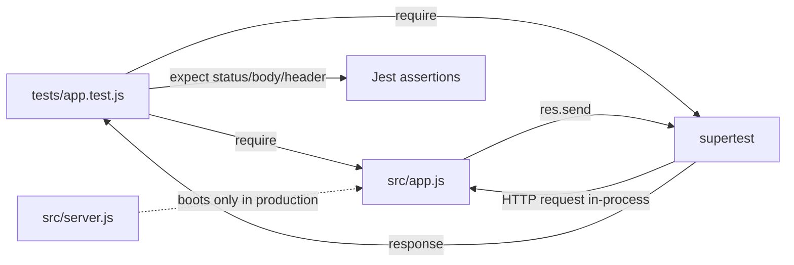

# Technical Specification

# 0. Agent Action Plan

## 0.1 Intent Clarification

### 0.1.1 Core Testing Objective

Based on the provided requirements, the Blitzy platform understands that the testing objective is to author an automated test suite that verifies the HTTP behavior of an Express.js application exposing exactly two GET endpoints — one returning the response body `Hello world` (described by the user as the pre-existing tutorial endpoint) and one returning the response body `Good evening` (the new endpoint the user is requesting be added).

**Request categorization:** **Add new tests** (no existing tests are present in the repository to update, fix, or extend; this is a green-field test authoring exercise).

**User-supplied requirements with enhanced technical clarity:**

| User-Stated Requirement | Technically Precise Restatement |
| --- | --- |
| "tutorial of node js server hosting one endpoint that returns the response 'Hello world'" | An Express HTTP route — handler `GET /` — must respond with HTTP `200 OK` and a response body containing the literal string `Hello world`. The test suite asserts this exact behavior. |
| "add expressjs into the project" | The `express` npm package is added as a runtime dependency in `package.json`; an Express application is constructed via `express()` and exported from `src/app.js`. The test suite imports this application directly (no port binding) and exercises it via Supertest. |
| "add another endpoint that return the reponse of 'Good evening'" | An Express HTTP route — handler `GET /good-evening` — must respond with HTTP `200 OK` and a response body containing the literal string `Good evening`. The test suite asserts this exact behavior. |

**User Examples (preserved verbatim for use as test assertions):**

- User Example (response body 1): `Hello world`
- User Example (response body 2): `Good evening`

**Implicit testing needs surfaced from the user's stated objectives:**

- HTTP status assertions — every successful endpoint invocation must return `200`.
- Exact response-body assertions — Supertest `.expect(<status>, <body>)` or `.text === '<expected>'` to confirm the literal strings.
- Content-Type validation — Express's `res.send(string)` defaults to `text/html; charset=utf-8`; tests assert the `Content-Type` header includes `text/html` and `charset=utf-8`.
- Unknown-route handling — `GET /does-not-exist` must return `404 Not Found` (the Express default for unmatched paths).
- HTTP method handling — non-GET methods on the two defined paths (e.g., `POST /good-evening`) must return `404` (Express's default behavior when only `GET` is registered).
- Route isolation — exercising one endpoint does not alter the behavior of the other (parallel test execution must remain safe).
- Repeatability — repeated calls to the same endpoint return the same response (statelessness).

### 0.1.2 Special Instructions and Constraints

**Verbatim user input (preserved):**

> "add feature to a existing product
> this is a tutorial of node js server hosting one endpoint that returns the response \"Hello world\". Could you add expressjs into the project and add another endpoint that return the reponse of \"Good evening\"?"

**Constraints derived from the user's wording:**

- The user describes the project as a "tutorial" — implying simplicity, no advanced architecture, no premature optimization. Tests should be readable and idiomatic, not exotic.
- The user explicitly says "add expressjs into the project" — Express is the mandated HTTP framework. No alternative web framework (Fastify, Koa, raw `http`) is in scope.
- The user supplies the exact response strings (`Hello world` and `Good evening`). These strings are normative; assertions must match them character-for-character (case-sensitive, no surrounding whitespace alterations).
- No user-specified implementation rules were supplied (the rules array is empty `[]`).
- No environment variables, secrets, or attached files were supplied.

**Special instruction — pre-implementation state of the repository:** The repository `Check11May` is empty save for `README.md` (12 bytes, content `# Check11May`). The user's wording "tutorial of node js server hosting one endpoint that returns the response 'Hello world'" describes intent, not present reality — there is no existing server, no `package.json`, no source code, and no test infrastructure. Consequently, the test suite cannot run against existing code; the minimal Express application skeleton that the tests exercise must also be created as a supporting precondition.

**Web search research requirements:** Verify current stable versions of Jest, Supertest, and Express compatible with the installed Node.js v22 runtime so that the dependency manifest specifies versions that will resolve and install without engine-mismatch warnings.

### 0.1.3 Technical Interpretation

These testing requirements translate to the following technical test implementation strategy:

| Requirement | Test Implementation Action |
| --- | --- |
| Verify `GET /` returns `Hello world` with `200` | Create `tests/app.test.js` with a Supertest case: `await request(app).get('/').expect(200).expect('Hello world')`. |
| Verify `GET /good-evening` returns `Good evening` with `200` | Add a Supertest case: `await request(app).get('/good-evening').expect(200).expect('Good evening')`. |
| Verify Content-Type for both routes | Add cases: `.expect('Content-Type', /text\/html/)` (Express `res.send(string)` default). |
| Verify unknown routes return 404 | Add a case: `await request(app).get('/no-such-route').expect(404)`. |
| Verify non-GET methods return 404 on the defined paths | Add a case: `await request(app).post('/good-evening').expect(404)`. |
| Verify routes are isolated and repeatable | Use independent `describe` blocks per endpoint; run Jest in default parallel mode and assert idempotence within a `it.each` or twice-invoked block. |
| Enable Supertest without port binding | Author `src/app.js` to export the configured `app`; author `src/server.js` to bind the listener. Tests import only `src/app.js`. |
| Enable `npm test` to run the suite | Add `"test": "jest"` and `"test:coverage": "jest --coverage"` scripts to `package.json`. |

**Format pattern used throughout this section:** "To `<test goal>`, we will `<create|update|fix>` `<specific test files>`."

- To assert the Hello-world endpoint behavior, we will **create** `tests/app.test.js` with Supertest assertions targeting `GET /`.
- To assert the Good-evening endpoint behavior, we will **create** additional cases within `tests/app.test.js` targeting `GET /good-evening`.
- To enable Supertest invocation against the Express instance without TCP port binding, we will **create** `src/app.js` exporting the application factory.
- To run tests reproducibly, we will **create** `package.json` with `test` / `test:coverage` scripts and a Jest configuration block (or a separate `jest.config.js`).

### 0.1.4 Coverage Requirements Interpretation

**Explicit coverage targets stated by the user:** None.

**Implicit coverage expectations** (inferred from industry standards for the language/framework and from critical-path analysis of the trivial functionality):

- The two route handlers and the Express app construction are the only meaningful executable code. Each handler is a single `res.send('<literal>')` statement.
- Given this trivial complexity, the test suite can — and therefore should — achieve **≥ 90% coverage across statements, branches, functions, and lines** on `src/app.js`. There are no branches in the handlers themselves, so branch coverage is trivially satisfied; functions and statements coverage follow directly from invoking each endpoint at least once.
- `src/server.js` (the port-binding entrypoint) is excluded from coverage measurement because its sole responsibility — `app.listen(PORT)` — is environmental boilerplate that would require process-level orchestration to test and that adds no behavioral signal.

To achieve comprehensive testing, coverage should include:

- Every registered route (`GET /`, `GET /good-evening`) — each invoked with the correct method.
- Every response surface (status, Content-Type header, response body) — asserted explicitly.
- At least one negative case for unknown routes (`GET /no-such-route` → `404`).
- At least one negative case for unsupported methods on a defined path (`POST /good-evening` → `404`).


## 0.2 Test Discovery and Analysis

### 0.2.1 Existing Test Infrastructure Assessment

A comprehensive search of the repository was conducted to identify any test files, test configuration, test runners, mocking libraries, or test fixtures. The repository was inspected via `get_source_folder_contents` on the root path and via direct shell traversal.

**Search patterns employed:**

- File-name patterns: `*test*`, `*spec*`, `test_*`, `spec_*`, `*_test.*`, `*_spec.*`
- Configuration patterns: `jest.config.*`, `pytest.ini`, `.mocharc.*`, `karma.conf.*`, `vitest.config.*`, `.coveragerc`
- Dependency manifest discovery: `package.json`, `package-lock.json`, `yarn.lock`, `pnpm-lock.yaml`, `.nvmrc`
- Ignore-file discovery: `.blitzyignore`, `.gitignore`

**Repository analysis result:** The repository `Check11May` (at `/tmp/blitzy/Check11May/main_0d6e40`) contains **only** `README.md` (12 bytes, content `# Check11May`) and a `.git/` directory. No test files, no test configuration, no dependency manifest, and no `.blitzyignore` files exist anywhere in the workspace.

| Discovery Dimension | Finding |
| --- | --- |
| Current testing framework | None — must be introduced. |
| Test runner configuration location | None — must be created (recommended: `jest.config.js` at repo root). |
| Coverage tools in use | None — Jest's built-in coverage reporter (Istanbul-based) will be enabled. |
| Mock/stub libraries detected | None — Jest's built-in `jest.fn()` / `jest.mock()` cover any future needs; for the in-scope test cases no mocks are required. |
| Test data fixtures or factories present | None — fixtures are unnecessary because the endpoints accept no input. |
| Existing test files | None — zero pre-existing tests for either endpoint. |
| Pre-existing source code under test | None — `src/app.js` and `src/server.js` are introduced as test-enablement preconditions. |

**Documented finding:** *Repository analysis reveals no testing framework, no test files, and no dependency manifest. Testing infrastructure must be introduced from scratch in concert with the minimal Express application that the tests will exercise.*

### 0.2.2 Web Search Research Conducted

The following research was performed against the npm registry (`registry.npmjs.org`, HTTP 200 confirmed) to identify currently published, mutually compatible, and Node.js v22-supporting versions of the testing stack:

| Research Question | Source | Finding |
| --- | --- | --- |
| Latest stable Jest version | `npm view jest version` | `30.4.2` |
| Jest engines (Node compatibility) | `npm view jest engines` | `node: ^18.14.0 \|\| ^20.0.0 \|\| ^22.0.0 \|\| >=24.0.0` — Node 22 explicitly supported. |
| Latest stable Supertest version | `npm view supertest version` | `7.2.2` |
| Supertest engines (Node compatibility) | `npm view supertest engines` | `node: >=14.18.0` — Node 22 supported. |
| Latest stable Express version | `npm view express version` | `5.2.1` |
| Express engines (Node compatibility) | `npm view express engines` | `node: >=18` — Node 22 supported. |
| Jest LTS (29.x) latest | `npm view jest@29 version` | `29.7.0` — available if the user prefers a more conservative pin. |
| Supertest 6.x latest | `npm view supertest@6 version` | `6.3.4` — available as a fallback. |

**Additional considerations researched:**

- **Best practices for Express testing patterns:** The de-facto convention is to (a) separate the app definition from the port binding by exporting the Express `app` instance from one module and calling `.listen()` from a separate `server.js` entry-point, and (b) drive HTTP assertions with Supertest, which invokes the app's request handler in-process via Node's `http.Server` without actually binding a TCP port.
- **Recommended mocking strategy:** None required — the two route handlers have no external collaborators (no DB, no HTTP fetch, no file I/O, no environment-dependent behavior).
- **Test organization conventions for Node.js / Jest:** Tests are placed under a top-level `tests/` directory or co-located alongside source under `__tests__/`. For this project, a top-level `tests/` directory is selected for visibility in a tutorial context. File-name convention: `*.test.js` (Jest's default pattern).
- **Common pitfalls to avoid:**
   - Calling `app.listen()` inside `app.js` — would force tests to manage ports and risks port collisions in parallel runs. *Mitigation:* app/server split (see §0.4).
   - Importing `server.js` from tests — would start a real listener. *Mitigation:* tests import `src/app.js` only.
   - Asserting response body with `.expect(<exact string>)` while Express returns HTML-encoded content — *Mitigation:* the response strings (`Hello world`, `Good evening`) contain no HTML-special characters and `res.send(string)` returns them unchanged; assertions remain literal.
   - Forgetting `--watchAll=false` in non-interactive environments — would cause Jest to hang. *Mitigation:* the `test` script in `package.json` uses `jest` (which already exits after a single run in non-TTY environments); `test:ci` adds `--ci --watchAll=false` explicitly for safety.


## 0.3 Testing Scope Analysis

### 0.3.1 Test Target Identification

**Primary code to be tested:**

| Target | Path | Required Test Categories |
| --- | --- | --- |
| Express application factory | `src/app.js` (to be created) | Integration — exercises the configured app via Supertest. |
| Route handler `GET /` (returns `Hello world`) | `src/app.js` (route registration) | Happy path, content-type, repeatability. |
| Route handler `GET /good-evening` (returns `Good evening`) | `src/app.js` (route registration) | Happy path, content-type, repeatability. |
| Unmatched-route fallback | Implicit Express default | Negative path — unknown route returns 404. |
| Unsupported HTTP method | Implicit Express default | Negative path — non-GET method on a defined path returns 404. |

**Functions / handlers under test (enumerated):**

- `app` (the default export of `src/app.js`) — instantiates `express()`, registers the two routes, and is consumed by Supertest.
- The anonymous `(req, res) => res.send('Hello world')` callback bound to `GET /`.
- The anonymous `(req, res) => res.send('Good evening')` callback bound to `GET /good-evening`.

**Existing test file mapping:**

| Source File | Existing Test File | Test Categories Present |
| --- | --- | --- |
| `src/app.js` (to be created) | *(none — no test file exists)* | None — the entire test surface is new. |
| `src/server.js` (to be created) | *(none — and not directly tested; excluded from coverage)* | N/A — port-binding boilerplate is outside the test scope. |

**Dependencies requiring mocking:**

- External services to mock — **none** (no external HTTP, no message bus, no third-party API).
- Database interactions to stub — **none** (no database is used).
- File system operations to virtualize — **none** (no file I/O occurs in the route handlers).
- Time/randomness sources — **none** (the responses are deterministic literals).

No `jest.mock()`, no `jest.fn()`, and no manual mock modules are required for the in-scope test cases.

### 0.3.2 Version Compatibility Research

Based on the installed runtime (Node.js v22.22.2, npm 11.1.0) and the engine ranges retrieved from the npm registry, the recommended testing stack is:

| Component | Recommended Version | Rationale |
| --- | --- | --- |
| Node.js runtime | `22.22.2` (already installed at `/usr/bin/node`) | Active LTS line; satisfies every package's `engines.node` constraint listed below. |
| Express (production framework) | `^5.2.1` | Latest stable; `engines.node: >=18` — satisfied. The user requested "expressjs" without specifying a major version; the npm-registry default (`express@latest`) currently resolves to 5.x. |
| Jest (test framework + runner + coverage) | `^30.4.2` | Latest stable; `engines.node: ^18.14.0 \|\| ^20.0.0 \|\| ^22.0.0 \|\| >=24.0.0` — Node 22 explicitly listed. Built-in coverage via `--coverage`. |
| Supertest (HTTP assertion library) | `^7.2.2` | Latest stable; `engines.node: >=14.18.0` — satisfied. Accepts an Express app or a Node `http.Server` directly. |

**Assertion library:** Jest's built-in `expect` API — no separate assertion package required (Chai, should, etc. are not in scope).

**Mocking library:** Jest's built-in `jest.fn()` / `jest.mock()` — sufficient for any future need; no usage in the in-scope test cases.

**Coverage tool:** Jest's `--coverage` flag uses Istanbul's `v8` provider by default — no additional package required.

**Documented version conflicts to resolve:** None. Every chosen package's engine constraint is independently satisfied by Node 22.22.2, and no peer-dependency conflicts exist between Jest 30, Supertest 7, and Express 5.

**Fallback / alternative pins** (presented for reference; the recommended versions above are the chosen defaults):

| Component | Alternative | When to Prefer |
| --- | --- | --- |
| Jest | `^29.7.0` | If a more conservative, longer-deployed major is preferred. Still supports Node 22. |
| Supertest | `^6.3.4` | If matching older tutorials that pin Supertest 6.x. |
| Express | `^4.22.1` | If aligning with older Express 4.x examples or middleware whose Express 5 compatibility is uncertain. |


## 0.4 Test Implementation Design

### 0.4.1 Test Strategy Selection

The test strategy combines a small number of **HTTP integration tests** authored in Jest and executed via Supertest. Pure unit tests (e.g., invoking the route handler callback in isolation with a synthetic `req` / `res` pair) are deliberately not added: each handler is a one-line `res.send('<literal>')` call whose only meaningful behavior — status code, content-type, body — is exactly what Supertest asserts already, and a separate unit test for it would duplicate signal without adding rigor.

**Test types to implement:**

- **HTTP integration tests** (primary) — Supertest invokes the Express request handler in-process against the exported `app` instance. Asserts: status code, body, `Content-Type` header.
- **Edge-case tests** — unknown route paths (`/does-not-exist`) return `404`; case-sensitivity verified by Express default semantics (`GET /HELLO` returns `404` because only lowercase `/` is registered).
- **Error-handling tests** — unsupported HTTP methods on a defined path (`POST /good-evening`) return `404` per Express's default routing semantics (no route registered for the method/path pair).
- **Performance boundaries** — not applicable (trivial handler, no I/O, no load-testing goal).



### 0.4.2 Test Case Blueprint

```
Component: Express app (src/app.js) — route GET /
Test Categories:
- Happy path: returns 200 with body "Hello world"
- Happy path: Content-Type header is "text/html; charset=utf-8"
- Edge cases: case-sensitive path — GET /HELLO returns 404
- Error cases: POST / returns 404 (no POST handler)
- Repeatability: two sequential GETs return identical responses
- Performance boundaries: not applicable

Component: Express app (src/app.js) — route GET /good-evening
Test Categories:
- Happy path: returns 200 with body "Good evening"
- Happy path: Content-Type header is "text/html; charset=utf-8"
- Edge cases: case-sensitive path — GET /Good-Evening returns 404
- Error cases: POST /good-evening returns 404 (no POST handler)
- Repeatability: two sequential GETs return identical responses
- Performance boundaries: not applicable

Component: Express app (src/app.js) — global routing semantics
Test Categories:
- Negative path: GET /does-not-exist returns 404
- Route isolation: assertions on /good-evening do not affect /
- Independent execution: tests can run in parallel and in any order
```

**Concrete test-case inventory (each maps to one Jest `it()` block inside `tests/app.test.js`):**

| # | `describe` block | `it()` description | Method | Path | Expected Status | Expected Body | Other Assertions |
| --- | --- | --- | --- | --- | --- | --- | --- |
| 1 | `GET /` | returns 200 with "Hello world" body | GET | `/` | 200 | `Hello world` | — |
| 2 | `GET /` | returns text/html content type | GET | `/` | 200 | — | `Content-Type` matches `/text\/html/` |
| 3 | `GET /` | is case-sensitive (HELLO → 404) | GET | `/HELLO` | 404 | — | — |
| 4 | `GET /` | rejects non-GET methods (POST → 404) | POST | `/` | 404 | — | — |
| 5 | `GET /` | is idempotent across repeated calls | GET ×2 | `/` | 200 ×2 | `Hello world` ×2 | — |
| 6 | `GET /good-evening` | returns 200 with "Good evening" body | GET | `/good-evening` | 200 | `Good evening` | — |
| 7 | `GET /good-evening` | returns text/html content type | GET | `/good-evening` | 200 | — | `Content-Type` matches `/text\/html/` |
| 8 | `GET /good-evening` | is case-sensitive (Good-Evening → 404) | GET | `/Good-Evening` | 404 | — | — |
| 9 | `GET /good-evening` | rejects non-GET methods (POST → 404) | POST | `/good-evening` | 404 | — | — |
| 10 | `GET /good-evening` | is idempotent across repeated calls | GET ×2 | `/good-evening` | 200 ×2 | `Good evening` ×2 | — |
| 11 | `unknown routes` | unmatched path returns 404 | GET | `/does-not-exist` | 404 | — | — |

**Skeleton excerpt** (illustrative — actual implementation lives in `tests/app.test.js`):

```js
const request = require('supertest');
const app = require('../src/app');

describe('GET /', () => {
  it('returns 200 with "Hello world" body', async () => {
    await request(app).get('/').expect(200).expect('Hello world');
  });
});
```

### 0.4.3 Existing Test Extension Strategy

- **Tests to extend:** None — no pre-existing tests exist in the repository. The entire test surface is new.
- **Tests to refactor:** None — there is nothing to refactor.
- **Tests to fix:** None — there are no broken tests because there are no tests.

This sub-section is intentionally brief because the repository is in a pre-implementation state; all test authoring is green-field.

### 0.4.4 Test Data and Fixtures Design

- **Required test data structures:** None. The two endpoints accept no request body, no query parameters, no path parameters, and no headers that influence behavior. The only "data" the tests need is the expected response-body string literals (`Hello world`, `Good evening`), which are hard-coded inline at the assertion sites for readability.
- **Fixture organization strategy:** No dedicated `tests/fixtures/` directory is created. Were future endpoints to require JSON payloads or seeded state, the conventional location would be `tests/fixtures/<feature>.json` — but that is out of scope here.
- **Mock object specifications:** None — see §0.3.1 (no external dependencies to mock).
- **Test database / state management approach:** None — the endpoints are stateless. Jest's default test isolation (a fresh module registry per test file) plus the lack of mutable state in `src/app.js` together guarantee parallel-execution safety without further effort.


## 0.5 Test File Transformation Mapping

### 0.5.1 File-by-File Test Plan

Every file in scope is enumerated below. Five files are created; one file is referenced for context; no file is updated or deleted (the repository is empty save for `README.md`).

**Transformation modes:** `CREATE` — new file; `UPDATE` — modify existing file; `DELETE` — remove existing file; `REFERENCE` — read-only context source.

| Target Test File | Transformation | Source File / Test | Purpose / Changes |
| --- | --- | --- | --- |
| `tests/app.test.js` | CREATE | `src/app.js` | Add comprehensive HTTP integration tests for both endpoints — happy paths (status, body, content-type), edge cases (case-sensitive paths), negative paths (404 for unknown route, 404 for non-GET methods), and repeatability. Authored in Jest, executed via Supertest. Eleven `it()` blocks per the blueprint in §0.4.2. |
| `jest.config.js` | CREATE | *(none — new test configuration)* | Provide Jest configuration: `testEnvironment: 'node'`, `testMatch: ['**/tests/**/*.test.js']`, coverage settings (provider, collect-from globs, exclusion of `src/server.js`, coverage thresholds). |
| `src/app.js` | CREATE | *(test enablement precondition — no source exists)* | Author the Express application factory: instantiate `express()`, register `GET /` and `GET /good-evening`, export the configured `app` without calling `.listen()`. This file is the System Under Test. |
| `src/server.js` | CREATE | *(test enablement precondition — no entrypoint exists)* | Author the runtime entry-point: import `./app`, call `app.listen(PORT)` where `PORT` defaults to `3000` and reads `process.env.PORT` if set. Excluded from test coverage. |
| `package.json` | CREATE | *(no prior manifest)* | Declare dependencies (`express`), devDependencies (`jest`, `supertest`), `engines.node`, and scripts (`start`, `test`, `test:coverage`, `test:ci`). Without this file, `npm install` cannot resolve packages and `npm test` cannot invoke Jest. |
| `README.md` | REFERENCE | `README.md` | Existing single-line content (`# Check11May`) provides repository name only; no testing context is derivable from it. The file is read-only context. |

**Wildcard / pattern entries (none are deferred):** The two endpoints are exhaustively enumerated; no `tests/**/*.test.js` placeholder is needed because the single file `tests/app.test.js` covers both endpoints. No test file is left as "pending" or "to be discovered".

### 0.5.2 New Test Files Detail

**`tests/app.test.js`** — comprehensive integration tests for the Express app

- **Test categories:** happy path (status + body + headers), edge cases (case-sensitive paths), error cases (404 for unknown routes, 404 for non-GET methods), repeatability (idempotent GET).
- **Mock dependencies:** none.
- **Assertions focus:** HTTP status equality, exact response-body string equality, `Content-Type` header regex match.
- **Imports:** `const request = require('supertest');` and `const app = require('../src/app');`
- **Concurrency:** safe to run in parallel with any number of workers because the app is stateless and Supertest binds an ephemeral port per request.

**`jest.config.js`** — Jest configuration

- **Test categories addressed:** governs the entire suite (only one test file exists).
- **Key options:**
   - `testEnvironment: 'node'` — Node environment (no JSDOM needed).
   - `testMatch: ['**/tests/**/*.test.js']` — picks up `tests/app.test.js`.
   - `collectCoverageFrom: ['src/**/*.js', '!src/server.js']` — measures coverage on `src/app.js` only.
   - `coverageThreshold.global`: 90 / 90 / 90 / 90 (statements / branches / functions / lines).
   - `verbose: true` — emits per-test status during `npm test`.

**`tests/fixtures/`** — **not created.** Reason: endpoints accept no inputs; no fixture data is required.

**`tests/helpers/`** — **not created.** Reason: a single test file with eleven assertions does not justify a helper module; readability is best preserved with inline Supertest chains.

**`tests/mocks/`** — **not created.** Reason: no external collaborators exist to mock.

### 0.5.3 Test Files to Modify Detail

There are no test files to modify. The repository contains no pre-existing tests, no test configuration, no fixtures, no mocks, and no helpers. This sub-section is intentionally brief and is preserved for structural completeness with the testing-flavor prompt.

### 0.5.4 Test Configuration Updates

The single test configuration file `jest.config.js` is **created** (not updated). The relevant settings are enumerated in §0.5.2. No other configuration file (coverage config, runner config, environment config) exists or needs editing.

**Coverage configuration specifics inside `jest.config.js`:**

- `coverageProvider: 'v8'` (Node's native V8 coverage; Jest's default since v30).
- `coverageReporters: ['text', 'lcov', 'json-summary']` — text for terminal, lcov for IDE plug-ins, json-summary for CI parsing.
- `coverageThreshold.global`: `{ statements: 90, branches: 90, functions: 90, lines: 90 }` — fails the run if any metric drops below 90%.
- `coveragePathIgnorePatterns: ['/node_modules/', 'src/server.js']`.

**Test runner configuration specifics inside `package.json`:**

- `"test": "jest"` — single-run by default (Jest does not enter watch mode in non-TTY contexts).
- `"test:coverage": "jest --coverage"` — adds the coverage reporter and applies thresholds.
- `"test:ci": "jest --ci --watchAll=false --runInBand"` — non-interactive, deterministic single-run for CI / automation contexts.

### 0.5.5 Cross-File Test Dependencies

- **Shared fixtures:** None — see §0.5.2.
- **Mock objects:** None — see §0.5.2.
- **Test utilities (helper functions):** None — assertions are inline.
- **Import updates required across test files:** None — only one test file exists. The single import path is `require('../src/app')` (relative to `tests/app.test.js`).


## 0.6 Dependency Inventory

### 0.6.1 Testing Dependencies

The repository has no `package.json` today. The manifest will be created with the following dependency declarations. All versions were verified live against `registry.npmjs.org` and against each package's `engines.node` constraint for Node.js v22.

| Registry | Package Name | Version (semver range to declare) | Resolved Version (at time of writing) | Dependency Type | Purpose |
| --- | --- | --- | --- | --- | --- |
| npm | `express` | `^5.2.1` | `5.2.1` | dependencies | HTTP framework — provides the `app` object, `app.get()` route registration, and `res.send()` response API for both endpoints. Required at runtime. |
| npm | `jest` | `^30.4.2` | `30.4.2` | devDependencies | Test runner + assertion library + built-in coverage reporter. Used by `npm test`. |
| npm | `supertest` | `^7.2.2` | `7.2.2` | devDependencies | In-process HTTP assertion library — wraps the Express `app` with Node's `http.Server` on an ephemeral port and exposes a fluent assertion API (`request(app).get(path).expect(...)`). |

**Notes on the chosen ranges:**

- All ranges use the caret (`^`) prefix to permit minor / patch upgrades within the same major. This is consistent with Jest, Supertest, and Express semver discipline.
- No pre-release identifiers (no `-alpha`, no `-rc`) are pinned — only stable releases.
- No "latest" / "1.0.0" placeholders are used; every version was retrieved via `npm view <package> version`.
- No `peerDependencies` are required by Jest or Supertest beyond what Node provides. Jest declares an optional peer of `node-notifier`, which is not added (notifications are not used).
- The `engines.node` field in `package.json` is set to `">=18"` (the most restrictive engine among the three packages — Express 5's `>=18`). Node 22.22.2 satisfies this.

**Optional type packages (not added):** `@types/jest`, `@types/supertest`, `@types/express` — not added because the project uses plain JavaScript (the user described a "tutorial of node js server", not a TypeScript project). Were TypeScript adopted later, these would be the canonical type packages.

### 0.6.2 Import Updates (If applicable)

No import updates are required. The repository contains no JavaScript files prior to this work, so there are no module references to refactor.

The new test file declares exactly the following imports:

- `const request = require('supertest');` — Supertest entry-point.
- `const app = require('../src/app');` — relative path from `tests/app.test.js` to the System Under Test.

The new source files declare the following imports:

- `src/app.js`: `const express = require('express');` — the only dependency.
- `src/server.js`: `const app = require('./app');` — internal reference.

**Import transformation rules** (none required, presented for structural completeness only): The repository's empty state means there is no "Old → New" import mapping to apply. All imports are introduced fresh.


## 0.7 Coverage and Quality Targets

### 0.7.1 Coverage Metrics

**Current coverage:** 0% across every metric (no test file exists; `src/app.js` does not yet exist either).

**Target coverage:** **≥ 90%** across statements, branches, functions, and lines, measured on `src/app.js` only. This target is justified by the trivial complexity of the handlers — each is a single `res.send('<literal>')` expression with no conditionals, no loops, and no exception paths to exercise. A test suite that invokes each endpoint at least once via Supertest will already touch every statement, every function, and (trivially) every branch in `src/app.js`.

**Coverage gaps to address:**

| Component | Current Coverage | Target Coverage | Focus Areas |
| --- | --- | --- | --- |
| `src/app.js` | 0% (file does not exist yet) | ≥ 90% (statements / branches / functions / lines) | Both route handlers exercised; unknown-route fallback covered. |
| `src/server.js` | N/A | Excluded from measurement | Pure port-binding boilerplate; excluded via `coveragePathIgnorePatterns: ['src/server.js']`. |

**Per-file coverage targets:**

| File | Statements | Branches | Functions | Lines |
| --- | --- | --- | --- | --- |
| `src/app.js` | ≥ 90% | ≥ 90% | ≥ 90% | ≥ 90% |
| `src/server.js` | excluded | excluded | excluded | excluded |

**Coverage enforcement:** The `jest.config.js` `coverageThreshold.global` block fails the test run when any metric falls below 90%. The `test:coverage` script (`jest --coverage`) is the canonical way to invoke coverage measurement.

### 0.7.2 Test Quality Criteria

- **Assertion density expectations:** Every `it()` block contains at least one explicit assertion. The eleven test cases enumerated in §0.4.2 yield approximately 14–16 distinct assertions across status, body, and header dimensions.
- **Test isolation requirements:** Each `it()` block is fully self-contained — it imports the `app` module (cached after the first import), creates a fresh Supertest request, and asserts. No shared mutable state, no `beforeAll` side effects, no global setup. Tests can run in any order.
- **Performance constraints for test execution:** The full suite must execute in well under one second on Node 22 (each Supertest call is in-process and the handlers have no I/O). No long timeouts are configured; Jest's default 5-second per-test timeout is more than sufficient.
- **Maintainability standards:** Eleven distinct `it()` descriptions written in plain English ("returns 200 with 'Hello world' body"), grouped under three `describe` blocks (`GET /`, `GET /good-evening`, `unknown routes`). Each assertion references the user-supplied response string verbatim — future readers can verify intent without external documentation.
- **Following repository test patterns and conventions:** No prior repository patterns exist. The patterns adopted (top-level `tests/` directory, `*.test.js` suffix, Jest + Supertest, app-factory separation) are the de-facto Node.js / Express community conventions and align with Jest's default discovery rules so that future tests will be picked up automatically.
- **Parallel-safety:** Every test is parallel-safe — Supertest acquires its own ephemeral port per call, the Express app holds no mutable state, and Jest's default worker model assigns separate worker processes anyway.


## 0.8 Scope Boundaries

### 0.8.1 Exhaustively In Scope

**New test files (CREATE):**

- `tests/app.test.js` — single test file containing all eleven `it()` blocks for both endpoints, the unknown-route case, and method-not-allowed cases.
- `tests/**/*.test.js` (pattern) — Jest's `testMatch` glob; no other test files exist today but the pattern will match any future additions to the `tests/` directory.

**Test configuration files (CREATE):**

- `jest.config.js` — Jest configuration (test environment, test match patterns, coverage settings, coverage thresholds).
- `package.json` — dependency manifest plus `test`, `test:coverage`, and `test:ci` scripts.

**Test-enablement source files (CREATE) — necessary supporting precondition because the repository is empty:**

- `src/app.js` — Express application factory exporting the configured `app` (the System Under Test). Without this file, there is no software for the test suite to assert against.
- `src/server.js` — runtime entry-point that calls `app.listen()`. Excluded from coverage; supplied so the project remains runnable outside the test environment (e.g., `node src/server.js`).

**Test utilities and helpers:** None — `tests/helpers/`, `tests/mocks/`, `tests/factories/`, `tests/utils/`, `tests/fixtures/` are NOT created because the in-scope test cases require none.

**Documentation updates:** None — the existing `README.md` is referenced only; no testing-section updates are required by the user. (If the broader implementation pipeline adds a testing-section paragraph to `README.md`, that addition is outside this AAP's testing-flavor remit.)

### 0.8.2 Explicitly Out of Scope

The following items are explicitly **not** part of this work:

- **Additional Express routes beyond `GET /` and `GET /good-evening`** — the user requested exactly these two endpoints; no `/health`, `/version`, or `/api/*` routes are added.
- **Express middleware** — no `body-parser`, no `cors`, no `helmet`, no logging middleware. The endpoints accept no request bodies and require no middleware.
- **TypeScript** — the user described a "tutorial of node js server"; the project remains plain JavaScript. No `tsconfig.json`, no `ts-jest`, no `@types/*` packages.
- **Linting / formatting** — no ESLint, no Prettier, no editorconfig. These are valuable for production codebases but are outside the user's stated request and outside the testing flavor.
- **CI/CD pipelines** — no GitHub Actions, no GitLab CI, no Jenkins, no Travis configurations. (The `test:ci` script is added for local CI-style execution but no pipeline file is created.)
- **Container artifacts** — no `Dockerfile`, no `docker-compose.yml`, no `.dockerignore`.
- **Source-code modifications beyond the minimum necessary to make endpoints testable** — `src/app.js` and `src/server.js` are created as the bare minimum; no refactoring is performed because there is nothing to refactor.
- **Performance / load testing** — no `autocannon`, no `k6`, no `artillery`. The endpoints are trivial; load testing is not warranted.
- **End-to-end tests via a real browser** — no Cypress, no Playwright. Supertest-level HTTP integration is the appropriate granularity.
- **Snapshot tests** — Jest's snapshot feature is not used; literal string assertions match the user's exact-string requirements (`Hello world`, `Good evening`).
- **Mock servers for external services** — none are needed because no external services are called.
- **Database fixtures, migrations, or seed scripts** — no database is used.
- **Code coverage uploads to external services** (Codecov, Coveralls) — coverage is reported locally only.
- **All items explicitly excluded by user instructions** — the user supplied no exclusions; this clause is preserved for prompt completeness.


## 0.9 Execution Parameters

### 0.9.1 Testing-Specific Instructions

The following commands are the canonical invocations for the test suite. All commands are non-interactive (no watch mode, no prompts) and safe to use in automated environments.

| Purpose | Exact Command |
| --- | --- |
| Install dependencies | `npm install` |
| Run the test suite (single run) | `npm test` |
| Run with coverage report and threshold enforcement | `npm run test:coverage` |
| Run in CI / automation mode (deterministic, single-worker) | `npm run test:ci` |
| Run a single test file | `npx jest tests/app.test.js --watchAll=false` |
| Run tests matching a name pattern | `npx jest -t "Hello world" --watchAll=false` |
| Debug mode (single worker, Node inspector) | `node --inspect-brk node_modules/.bin/jest --runInBand --watchAll=false` |
| Verify the server boots (smoke) | `node src/server.js` then `curl -s http://localhost:3000/` |
| Stop the smoke-test server | `Ctrl-C` or `pkill -f "node src/server.js"` |

**`package.json` `scripts` block (canonical):**

```json
{
  "scripts": {
    "start": "node src/server.js",
    "test": "jest",
    "test:coverage": "jest --coverage",
    "test:ci": "jest --ci --watchAll=false --runInBand"
  }
}
```

### 0.9.2 Specific Test Patterns to Follow in the Repository

No pre-existing patterns exist. The patterns enforced by the new test suite are:

- Test files placed under `tests/` at the repository root with the `.test.js` suffix.
- Each test file uses CommonJS `require(...)` (matching `src/app.js`, which also uses CommonJS — no `"type": "module"` is declared in `package.json`).
- Each test file imports `app` from `../src/app` and `request` from `supertest`.
- Each `describe` block groups tests by route (one `describe` per route) plus one `describe` for unknown-route handling.
- Each `it()` description begins with the expected behavior in active voice ("returns 200 with...", "is case-sensitive...").
- Assertions use Supertest's fluent `.expect(<status>[, <body>])` and `.expect('Content-Type', /regex/)` chains; Jest's `expect(...)` is used only when an assertion cannot be expressed via Supertest's chain.

### 0.9.3 Excluded Test Categories per User Instruction

The user supplied no exclusions. By default the suite excludes:

- Browser-based end-to-end tests (out of scope; see §0.8.2).
- Performance / load tests (out of scope; see §0.8.2).
- Snapshot tests (intentionally not used; literal string assertions are clearer for the user's exact-string requirements).

### 0.9.4 Environment Setup Requirements for Tests

| Requirement | Value / Setting |
| --- | --- |
| Node.js runtime | `>= 18` (declared in `package.json` `engines.node`); `22.22.2` is the runtime used during authoring and verified. |
| Package manager | `npm` (npm 11.1.0 verified). |
| Install command | `npm install` — installs `express`, `jest`, `supertest` from `package.json`. |
| Network access during install | Required (npm registry reachability confirmed: HTTP 200 from `https://registry.npmjs.org`). |
| Network access during test execution | Not required — Supertest invokes the Express handler in-process; no external requests are made. |
| Environment variables consumed by tests | None. |
| Environment variables consumed by `src/server.js` | `PORT` (optional; defaults to `3000`). Not used by the test suite. |
| Working directory | Repository root (`./`). |
| Operating system constraints | None — Node 22 + Jest 30 + Supertest 7 are cross-platform (Linux, macOS, Windows). |


## 0.10 Special Instructions for Testing

### 0.10.1 User-Supplied Testing Directives

The user supplied no testing-specific directives. The list of user-specified implementation rules supplied to this session is empty (`[]`). The user's request, preserved verbatim, is:

> "add feature to a existing product
> this is a tutorial of node js server hosting one endpoint that returns the response \"Hello world\". Could you add expressjs into the project and add another endpoint that return the reponse of \"Good evening\"?"

The user's request describes **feature work** (add Express; add a new endpoint). No instruction is given about minimum changes, test patterns to follow, mocking libraries to use, parallel execution, backward compatibility of test utilities, or naming conventions.

### 0.10.2 Resolution of the Request-vs-Flavor Conflict

This Agent Action Plan is generated under the **testing flavor** of the AAP framework, while the user's request is a feature-addition request. The resolution applied throughout this AAP is:

- **Primary deliverable** of the AAP is the **test suite** that exercises both endpoints described by the user. Section 0.5 (Test File Transformation Mapping) lists `tests/app.test.js` and `jest.config.js` as the primary in-scope artifacts.
- **Necessary supporting precondition:** because the repository contains no source code, the minimal Express application that the tests exercise (`src/app.js`, `src/server.js`, `package.json`) is also in scope — without it, no test would have anything to assert against. These files are listed as CREATE entries in §0.5.1 with the rationale "test enablement precondition".
- **All in-scope source code is bounded to the minimum that the tests require:** exactly two route handlers, the `express()` factory, and a port-binding entry-point. No additional features are introduced under the testing umbrella.

### 0.10.3 Inferred Testing-Specific Requirements

Because the user supplied no testing directives, the following principles are adopted by default and documented here for transparency:

- **Minimal change principle** (adopted): "ONLY modify test files and test-related configurations, plus the absolute minimum source files required to make the endpoints testable." For this AAP that minimum is `src/app.js`, `src/server.js`, and `package.json`.
- **Do not modify source code unless absolutely necessary for testability** (adopted): trivially satisfied because no source exists today; every source file is created at minimal scope.
- **Follow existing test patterns** (vacuously satisfied): no existing patterns exist — the patterns adopted are Node.js / Express community conventions.
- **Maintain test isolation using a stateless app factory + ephemeral-port Supertest pattern** (adopted): see §0.4 and §0.7.2.
- **Use Jest's built-in mocking when needed** (adopted): no mocks are required for the in-scope test cases, but the convention is established for any future addition.
- **Ensure all tests can run independently and in parallel** (adopted): see §0.7.2 (parallel-safety paragraph).
- **Maintain backward compatibility in test utilities** (vacuously satisfied): no test utilities exist; none are introduced.
- **Match existing code style and naming conventions in tests** (vacuously satisfied — no prior style exists). Adopted defaults: CommonJS modules, two-space indentation, double-quoted strings inside the assertions to match the user's quoting of `"Hello world"` and `"Good evening"`, `*.test.js` file-name suffix.

### 0.10.4 Open Items Flagged for Clarification

The following items are flagged because the user's brief did not resolve them. The defaults adopted are documented; the user may override any of them before implementation begins.

| Open Item | Default Adopted | Override If User Specifies |
| --- | --- | --- |
| Express major version | `^5.2.1` (npm-registry latest stable) | Pin `^4.22.1` if a tutorial source the user is following uses Express 4. |
| Jest major version | `^30.4.2` (npm-registry latest stable) | Pin `^29.7.0` if matching legacy tutorials. |
| HTTP path for the "Hello world" endpoint | `/` (most common tutorial pattern) | Update to `/hello` (or any explicit path) if the user clarifies. |
| HTTP path for the "Good evening" endpoint | `/good-evening` (kebab-case URL-safe form of the user's phrase) | Update to `/goodevening`, `/good_evening`, or another path if the user clarifies. |
| Module system | CommonJS (`require`) | Switch to ESM (`import`, `"type": "module"`) if the user prefers; will require `--experimental-vm-modules` for Jest. |
| Port for `src/server.js` | `3000`, overridable via `process.env.PORT` | Set a different default if the user prefers. |
| README testing section | Not updated under testing flavor | Add a "Testing" section with `npm test` instructions if the user requests it. |


